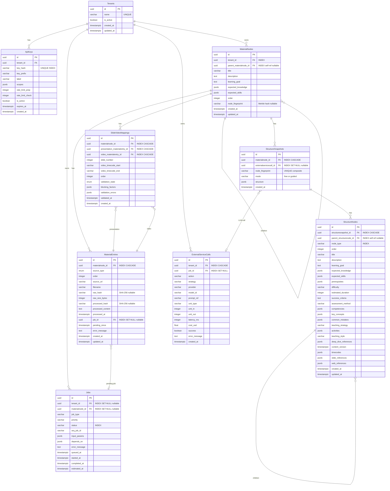

# Database Schema — course-supporter

> Auto-generated from ORM models (`src/course_supporter/storage/orm.py`).
> Migration: up to `f6a7b8c9d0e1` (FK rename + DB comments).
> All PKs are UUIDv7 (time-ordered). Timestamps use `TIMESTAMPTZ`.

---

## ER Diagram (Mermaid)

---

## Table Descriptions

### 1. `tenants`

**Comment:** Multi-tenant organizations

| Column | Type | Nullable | Default | Constraints | Comment |
|---|---|---|---|---|---|
| `id` | `UUID` | NO | UUIDv7 | **PK** | |
| `name` | `VARCHAR(200)` | NO | — | **UNIQUE** | |
| `is_active` | `BOOLEAN` | NO | `true` | | |
| `created_at` | `TIMESTAMPTZ` | NO | `now()` | | |
| `updated_at` | `TIMESTAMPTZ` | NO | `now()` | onupdate `now()` | |

**Indexes:**
- `tenants_pkey` — PRIMARY KEY (`id`)
- `ix_tenants_name` — UNIQUE (`name`)

**Relationships:**
- `tenants` 1 → N `api_keys` (cascade: all, delete-orphan)

---

### 2. `api_keys`

**Comment:** Authentication keys with scope-based access control

| Column | Type | Nullable | Default | Constraints | Comment |
|---|---|---|---|---|---|
| `id` | `UUID` | NO | UUIDv7 | **PK** | |
| `tenant_id` | `UUID` | NO | — | **FK** → `tenants.id` ON DELETE CASCADE | |
| `key_hash` | `VARCHAR(64)` | NO | — | **UNIQUE**, INDEX | SHA-256 hash of the API key. Raw key is never stored |
| `key_prefix` | `VARCHAR(16)` | NO | — | | First 8 chars of the key for identification in logs |
| `label` | `VARCHAR(100)` | NO | `'default'` | | |
| `scopes` | `JSONB` | NO | `[]` | | JSON array of granted scopes (prep, check) |
| `rate_limit_prep` | `INTEGER` | NO | `60` | | |
| `rate_limit_check` | `INTEGER` | NO | `300` | | |
| `is_active` | `BOOLEAN` | NO | `true` | | |
| `expires_at` | `TIMESTAMPTZ` | YES | — | | |
| `created_at` | `TIMESTAMPTZ` | NO | `now()` | | |

**Indexes:**
- `api_keys_pkey` — PRIMARY KEY (`id`)
- `ix_api_keys_key_hash` — UNIQUE (`key_hash`)

**Foreign Keys:**
- `tenant_id` → `tenants.id` ON DELETE CASCADE

**Relationships:**
- `api_keys` N → 1 `tenants`

---

### 3. `material_nodes`

**Comment:** Hierarchical tree of course materials. Root node (parent IS NULL) = course

| Column | Type | Nullable | Default | Constraints | Comment |
|---|---|---|---|---|---|
| `id` | `UUID` | NO | UUIDv7 | **PK** | |
| `tenant_id` | `UUID` | NO | — | **FK** → `tenants.id` ON DELETE CASCADE, INDEX | |
| `parent_materialnode_id` | `UUID` | YES | — | **FK** → `material_nodes.id` ON DELETE CASCADE, INDEX | Self-referential FK. NULL = root node (course level) |
| `title` | `VARCHAR(500)` | NO | — | | |
| `description` | `TEXT` | YES | — | | |
| `learning_goal` | `TEXT` | YES | — | | Pedagogical goal text for guided generation mode |
| `expected_knowledge` | `JSONB` | YES | — | | |
| `expected_skills` | `JSONB` | YES | — | | |
| `order` | `INTEGER` | NO | `0` | | |
| `node_fingerprint` | `VARCHAR(64)` | YES | — | | Merkle hash of content subtree. NULL = stale |
| `created_at` | `TIMESTAMPTZ` | NO | `now()` | | |
| `updated_at` | `TIMESTAMPTZ` | NO | `now()` | onupdate `now()` | |

**Indexes:**
- `material_nodes_pkey` — PRIMARY KEY (`id`)
- `ix_material_nodes_tenant_id` — (`tenant_id`)
- `ix_material_nodes_parent_materialnode_id` — (`parent_materialnode_id`)

**Foreign Keys:**
- `tenant_id` → `tenants.id` ON DELETE CASCADE
- `parent_materialnode_id` → `material_nodes.id` ON DELETE CASCADE (self-referential)

**Relationships:**
- `material_nodes` N → 1 `tenants`
- `material_nodes` N → 0..1 `material_nodes` (parent)
- `material_nodes` 1 → N `material_nodes` (children, cascade: all, delete-orphan)
- `material_nodes` 1 → N `material_entries` (cascade: all, delete-orphan)
- `material_nodes` 1 → N `slide_video_mappings` (cascade: all, delete-orphan)
- `material_nodes` 1 → N `structure_snapshots` (cascade: all, delete-orphan)

---

### 4. `material_entries`

**Comment:** Individual learning materials (video, presentation, text, web)

| Column | Type | Nullable | Default | Constraints | Comment |
|---|---|---|---|---|---|
| `id` | `UUID` | NO | UUIDv7 | **PK** | |
| `materialnode_id` | `UUID` | NO | — | **FK** → `material_nodes.id` ON DELETE CASCADE, INDEX | FK to parent MaterialNode in the tree |
| `source_type` | `ENUM('video','presentation','text','web')` | NO | — | `source_type_enum` | |
| `order` | `INTEGER` | NO | `0` | | |
| `source_url` | `VARCHAR(2000)` | NO | — | | |
| `filename` | `VARCHAR(500)` | YES | — | | |
| `raw_hash` | `VARCHAR(64)` | YES | — | | SHA-256 of uploaded raw file for integrity detection |
| `raw_size_bytes` | `INTEGER` | YES | — | | |
| `processed_hash` | `VARCHAR(64)` | YES | — | | SHA-256 of processed_content for Merkle tree |
| `processed_content` | `TEXT` | YES | — | | |
| `processed_at` | `TIMESTAMPTZ` | YES | — | | |
| `job_id` | `UUID` | YES | — | **FK** → `jobs.id` ON DELETE SET NULL, INDEX | FK to in-flight ingestion Job. NULL when idle |
| `pending_since` | `TIMESTAMPTZ` | YES | — | | |
| `error_message` | `TEXT` | YES | — | | |
| `created_at` | `TIMESTAMPTZ` | NO | `now()` | | |
| `updated_at` | `TIMESTAMPTZ` | NO | `now()` | onupdate `now()` | |

**Derived property (not in DB):** `state` — one of `raw`, `pending`, `ready`, `integrity_broken`, `error` (computed from `error_message`, `job_id`, `processed_content`, hashes).

**Indexes:**
- `material_entries_pkey` — PRIMARY KEY (`id`)
- `ix_material_entries_materialnode_id` — (`materialnode_id`)
- `ix_material_entries_job_id` — (`job_id`)

**Foreign Keys:**
- `materialnode_id` → `material_nodes.id` ON DELETE CASCADE
- `job_id` → `jobs.id` ON DELETE SET NULL

**Relationships:**
- `material_entries` N → 1 `material_nodes`
- `material_entries` N → 0..1 `jobs` (pending job)

---

### 5. `slide_video_mappings`

**Comment:** Presentation slide to video timecode mappings

| Column | Type | Nullable | Default | Constraints | Comment |
|---|---|---|---|---|---|
| `id` | `UUID` | NO | UUIDv7 | **PK** | |
| `materialnode_id` | `UUID` | NO | — | **FK** → `material_nodes.id` ON DELETE CASCADE, INDEX | FK to owning MaterialNode |
| `presentation_materialentry_id` | `UUID` | NO | — | **FK** → `material_entries.id` ON DELETE CASCADE, INDEX | |
| `video_materialentry_id` | `UUID` | NO | — | **FK** → `material_entries.id` ON DELETE CASCADE, INDEX | |
| `slide_number` | `INTEGER` | NO | — | | |
| `video_timecode_start` | `VARCHAR(20)` | NO | — | | |
| `video_timecode_end` | `VARCHAR(20)` | YES | — | | |
| `order` | `INTEGER` | NO | `0` | | |
| `validation_state` | `ENUM('validated','pending_validation','validation_failed')` | NO | `'pending_validation'` | `mapping_validation_state_enum` | Enum: pending_validation, validated, validation_failed |
| `blocking_factors` | `JSONB` | YES | — | | JSONB array of reasons preventing validation |
| `validation_errors` | `JSONB` | YES | — | | |
| `validated_at` | `TIMESTAMPTZ` | YES | — | | |
| `created_at` | `TIMESTAMPTZ` | NO | `now()` | | |

**Indexes:**
- `slide_video_mappings_pkey` — PRIMARY KEY (`id`)
- `ix_svm_materialnode` — (`materialnode_id`)
- `ix_svm_pres_materialentry` — (`presentation_materialentry_id`)
- `ix_svm_video_materialentry` — (`video_materialentry_id`)

**Foreign Keys:**
- `materialnode_id` → `material_nodes.id` ON DELETE CASCADE
- `presentation_materialentry_id` → `material_entries.id` ON DELETE CASCADE
- `video_materialentry_id` → `material_entries.id` ON DELETE CASCADE

**Relationships:**
- `slide_video_mappings` N → 1 `material_nodes`
- `slide_video_mappings` N → 1 `material_entries` (presentation)
- `slide_video_mappings` N → 1 `material_entries` (video)

---

### 6. `structure_snapshots`

**Comment:** LLM-generated course structure versions

| Column | Type | Nullable | Default | Constraints | Comment |
|---|---|---|---|---|---|
| `id` | `UUID` | NO | UUIDv7 | **PK** | |
| `materialnode_id` | `UUID` | NO | — | **FK** → `material_nodes.id` ON DELETE CASCADE, INDEX | FK to target MaterialNode (root = whole course) |
| `externalservicecall_id` | `UUID` | YES | — | **FK** → `external_service_calls.id` ON DELETE SET NULL, INDEX | |
| `node_fingerprint` | `VARCHAR(64)` | NO | — | part of UNIQUE index | Merkle hash at generation time for idempotency |
| `mode` | `VARCHAR(20)` | NO | — | part of UNIQUE index | `free` or `guided` |
| `structure` | `JSONB` | NO | — | | JSONB of generated course structure |
| `created_at` | `TIMESTAMPTZ` | NO | `now()` | | |

**Indexes:**
- `structure_snapshots_pkey` — PRIMARY KEY (`id`)
- `ix_snapshots_materialnode` — (`materialnode_id`)
- `ix_structure_snapshots_externalservicecall_id` — (`externalservicecall_id`)
- `uq_snapshots_identity` — **UNIQUE** (`materialnode_id`, `node_fingerprint`, `mode`)

**Foreign Keys:**
- `materialnode_id` → `material_nodes.id` ON DELETE CASCADE
- `externalservicecall_id` → `external_service_calls.id` ON DELETE SET NULL

**Relationships:**
- `structure_snapshots` N → 1 `material_nodes`
- `structure_snapshots` N → 0..1 `external_service_calls`
- `structure_snapshots` 1 → N `structure_nodes` (cascade: all, delete-orphan)

---

### 7. `structure_nodes`

**Comment:** Recursive tree of generated course structure elements

| Column | Type | Nullable | Default | Constraints | Comment |
|---|---|---|---|---|---|
| `id` | `UUID` | NO | UUIDv7 | **PK** | |
| `structuresnapshot_id` | `UUID` | NO | — | **FK** → `structure_snapshots.id` ON DELETE CASCADE, INDEX | |
| `parent_structurenode_id` | `UUID` | YES | — | **FK** → `structure_nodes.id` ON DELETE CASCADE, INDEX | Self-referential FK. NULL = top-level module |
| `node_type` | `VARCHAR(30)` | NO | — | INDEX | Enum: module, lesson, concept, exercise |
| `order` | `INTEGER` | NO | `0` | | |
| **Section 1: Formal & organisational (Methodologist agent)** | | | | | |
| `title` | `VARCHAR(500)` | NO | — | | |
| `description` | `TEXT` | YES | — | | |
| `learning_goal` | `TEXT` | YES | — | | |
| `expected_knowledge` | `JSONB` | YES | — | | |
| `expected_skills` | `JSONB` | YES | — | | |
| `prerequisites` | `JSONB` | YES | — | | |
| `difficulty` | `VARCHAR(20)` | YES | — | | |
| `estimated_duration` | `INTEGER` | YES | — | | |
| **Section 2: Results & assessment** | | | | | |
| `success_criteria` | `TEXT` | YES | — | | |
| `assessment_method` | `VARCHAR(50)` | YES | — | | |
| `competencies` | `JSONB` | YES | — | | |
| **Section 3: Methodological accents** | | | | | |
| `key_concepts` | `JSONB` | YES | — | | JSONB array of concept strings |
| `common_mistakes` | `JSONB` | YES | — | | |
| `teaching_strategy` | `VARCHAR(50)` | YES | — | | |
| `activities` | `JSONB` | YES | — | | |
| **Section 4: Context & adaptivity** | | | | | |
| `teaching_style` | `VARCHAR(50)` | YES | — | | |
| `deep_dive_references` | `JSONB` | YES | — | | |
| `content_version` | `TIMESTAMPTZ` | YES | — | | |
| **Section 5: Material references (Indexer agent)** | | | | | |
| `timecodes` | `JSONB` | YES | — | | JSONB of video timecode references |
| `slide_references` | `JSONB` | YES | — | | |
| `web_references` | `JSONB` | YES | — | | |
| **Timestamps** | | | | | |
| `created_at` | `TIMESTAMPTZ` | NO | `now()` | | |
| `updated_at` | `TIMESTAMPTZ` | NO | `now()` | onupdate `now()` | |

**Indexes:**
- `structure_nodes_pkey` — PRIMARY KEY (`id`)
- `ix_structure_nodes_structuresnapshot_id` — (`structuresnapshot_id`)
- `ix_structure_nodes_parent_structurenode_id` — (`parent_structurenode_id`)
- `ix_structure_nodes_node_type` — (`node_type`)

**Foreign Keys:**
- `structuresnapshot_id` → `structure_snapshots.id` ON DELETE CASCADE
- `parent_structurenode_id` → `structure_nodes.id` ON DELETE CASCADE (self-referential)

**Relationships:**
- `structure_nodes` N → 1 `structure_snapshots`
- `structure_nodes` N → 0..1 `structure_nodes` (parent)
- `structure_nodes` 1 → N `structure_nodes` (children, cascade: all, delete-orphan)

---

### 8. `jobs`

**Comment:** Background task queue entries (ingestion, generation)

| Column | Type | Nullable | Default | Constraints | Comment |
|---|---|---|---|---|---|
| `id` | `UUID` | NO | UUIDv7 | **PK** | |
| `tenant_id` | `UUID` | YES | — | **FK** → `tenants.id` ON DELETE SET NULL, INDEX | |
| `materialnode_id` | `UUID` | YES | — | **FK** → `material_nodes.id` ON DELETE SET NULL, INDEX | FK to target MaterialNode. NULL for orphaned jobs |
| `job_type` | `VARCHAR(50)` | NO | — | | |
| `priority` | `VARCHAR(20)` | NO | `'normal'` | | |
| `status` | `VARCHAR(20)` | NO | `'queued'` | INDEX | |
| `arq_job_id` | `VARCHAR(100)` | YES | — | | |
| `input_params` | `JSONB` | YES | — | | JSONB of task-specific parameters |
| `depends_on` | `JSONB` | YES | — | | JSONB array of Job UUIDs that must complete first |
| `error_message` | `TEXT` | YES | — | | |
| `queued_at` | `TIMESTAMPTZ` | NO | `now()` | | |
| `started_at` | `TIMESTAMPTZ` | YES | — | | |
| `completed_at` | `TIMESTAMPTZ` | YES | — | | |
| `estimated_at` | `TIMESTAMPTZ` | YES | — | | |

**Indexes:**
- `jobs_pkey` — PRIMARY KEY (`id`)
- `ix_jobs_tenant_id` — (`tenant_id`)
- `ix_jobs_materialnode_id` — (`materialnode_id`)
- `ix_jobs_status` — (`status`)

**Foreign Keys:**
- `tenant_id` → `tenants.id` ON DELETE SET NULL
- `materialnode_id` → `material_nodes.id` ON DELETE SET NULL

**Relationships:**
- `jobs` N → 0..1 `tenants`
- `jobs` N → 0..1 `material_nodes`
- `jobs` 1 → N `material_entries` (back-ref via `job_id`)

---

### 9. `external_service_calls`

**Comment:** Audit log of all external API calls (LLM, transcription, etc.)

| Column | Type | Nullable | Default | Constraints | Comment |
|---|---|---|---|---|---|
| `id` | `UUID` | NO | UUIDv7 | **PK** | |
| `tenant_id` | `UUID` | YES | — | **FK** → `tenants.id` ON DELETE CASCADE, INDEX | |
| `job_id` | `UUID` | YES | — | **FK** → `jobs.id` ON DELETE SET NULL, INDEX | |
| `action` | `VARCHAR(100)` | NO | `''` | | |
| `strategy` | `VARCHAR(50)` | NO | `'default'` | | |
| `provider` | `VARCHAR(50)` | NO | — | | Service type: llm, transcription, embedding, etc. |
| `model_id` | `VARCHAR(100)` | NO | — | | |
| `prompt_ref` | `VARCHAR(50)` | YES | — | | |
| `unit_type` | `VARCHAR(20)` | YES | — | | |
| `unit_in` | `INTEGER` | YES | — | | JSONB of request payload sent to external service |
| `unit_out` | `INTEGER` | YES | — | | JSONB of response received from external service |
| `latency_ms` | `INTEGER` | YES | — | | |
| `cost_usd` | `FLOAT` | YES | — | | |
| `success` | `BOOLEAN` | NO | `true` | | |
| `error_message` | `TEXT` | YES | — | | |
| `created_at` | `TIMESTAMPTZ` | NO | `now()` | | |

**Indexes:**
- `external_service_calls_pkey` — PRIMARY KEY (`id`)
- `ix_external_service_calls_tenant_id` — (`tenant_id`)
- `ix_external_service_calls_job_id` — (`job_id`)

**Foreign Keys:**
- `tenant_id` → `tenants.id` ON DELETE CASCADE
- `job_id` → `jobs.id` ON DELETE SET NULL

**Relationships:**
- `external_service_calls` N → 0..1 `tenants`
- `external_service_calls` N → 0..1 `jobs`

---

## Enums

| Enum Name | Values |
|---|---|
| `source_type_enum` | `video`, `presentation`, `text`, `web` |
| `mapping_validation_state_enum` | `validated`, `pending_validation`, `validation_failed` |

**Application-level enums** (stored as `VARCHAR`, validated in code):

| Enum | Column | Values |
|---|---|---|
| `GenerationMode` | `structure_snapshots.mode` | `free`, `guided` |
| `StructureNodeType` | `structure_nodes.node_type` | `module`, `lesson`, `concept`, `exercise` |
| `MaterialState` | _(derived, not stored)_ | `raw`, `pending`, `ready`, `integrity_broken`, `error` |

---

## FK Naming Convention

All foreign key columns follow the `{tablename}_id` pattern, where `tablename` is the
referenced table's `__tablename__` with underscores removed:

| Referenced Table | FK Column Pattern | Example |
|---|---|---|
| `tenants` | `tenant_id` | `api_keys.tenant_id` |
| `material_nodes` | `materialnode_id` | `material_entries.materialnode_id` |
| `material_entries` | `materialentry_id` | `slide_video_mappings.presentation_materialentry_id` |
| `structure_snapshots` | `structuresnapshot_id` | `structure_nodes.structuresnapshot_id` |
| `structure_nodes` | `structurenode_id` | `structure_nodes.parent_structurenode_id` |
| `external_service_calls` | `externalservicecall_id` | `structure_snapshots.externalservicecall_id` |
| `jobs` | `job_id` | `material_entries.job_id` |

Self-referential FKs use the `parent_` prefix:
- `material_nodes.parent_materialnode_id`
- `structure_nodes.parent_structurenode_id`
