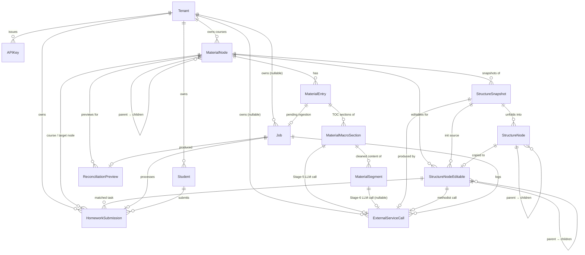

# Database Schema — course-supporter

**Snapshot:** 2026-04-17
**Source of truth:** `src/course_supporter/storage/orm.py`
**14 tables, multi-tenant, PostgreSQL 17 + pgvector**

**Update policy:** doc is refreshed after every migration merged to main.
Applied migrations covered here: up to and including
`a8b9c0d1e2f3_add_material_macro_segment_tables`.

---

## Зміст

1. [ER-діаграма](#er-діаграма)
2. [Доменні групи](#доменні-групи)
3. [Деталі таблиць](#деталі-таблиць)
   - [Tenancy & auth](#tenancy--auth)
     - [Tenant](#1-tenant)
     - [APIKey](#2-apikey)
   - [Контент і структура](#контент-і-структура)
     - [MaterialNode](#3-materialnode)
     - [MaterialEntry](#4-materialentry)
     - [MaterialMacroSection](#5-materialmacrosection)
     - [MaterialSegment](#6-materialsegment)
   - [Структурні snapshots і editable](#структурні-snapshots-і-editable)
     - [StructureSnapshot](#7-structuresnapshot)
     - [StructureNode](#8-structurenode)
     - [StructureNodeEditable](#9-structurenodeeditable)
     - [ReconciliationPreview](#10-reconciliationpreview)
   - [Інфраструктура](#інфраструктура)
     - [Job](#11-job)
     - [ExternalServiceCall](#12-externalservicecall)
   - [Homework](#homework)
     - [Student](#13-student)
     - [HomeworkSubmission](#14-homeworksubmission)
4. [LLM-генеровані JSONB поля — зведена таблиця](#llm-генеровані-jsonb-поля--зведена-таблиця)
5. [Примітки](#примітки)

---

## Part II — Target Design

Зміст Part II:

1. [Content Ingestion Layer — Target Design](#content-ingestion-layer--target-design)
   - [Motivation](#motivation)
   - [Decisions summary](#decisions-summary)
   - [Changes to existing tables](#changes-to-existing-tables)
   - [New tables: MaterialMacroSection, MaterialSegment](#new-tables)
   - [Processing pipeline](#processing-pipeline)
   - [Per-source specifications](#per-source-specifications)
   - [Position units reference](#position-units-reference-table)
   - [Architecture — Strategy pattern](#architecture--strategy-pattern)
   - [Migration path](#migration-path-5-prs-sequential)
   - [Open questions](#open-questions--to-decide-at-implementation-time)

---

## ER-діаграма



---

## Доменні групи

| Група | Таблиці | Призначення |
|---|---|---|
| **Tenancy & auth** | `tenants`, `api_keys` | Multi-tenant ізоляція, scope-based authz |
| **Контент і структура** | `material_nodes`, `material_entries`, `material_macro_sections`, `material_segments` | Дерево користувацького контенту: вузли + сирі матеріали + їх Table-of-Contents (макро-секції) + очищені/нарізані фрагменти для навігації агентів по змісту |
| **Структурні snapshots і editable** | `structure_snapshots`, `structure_nodes`, `structure_nodes_editable`, `reconciliation_previews` | Згенеровані LLM структури курсу (immutable) + editable working copy + reconciler preview |
| **Інфраструктура** | `jobs`, `external_service_calls` | ARQ-таски + audit log усіх зовнішніх викликів (LLM/STT/webhooks) |
| **Homework** | `students`, `homework_submissions` | Зовнішні студенти + submissions з Mentor pipeline |

---

## Деталі таблиць

### Tenancy & auth

#### 1. Tenant

**Таблиця:** `tenants`
**Призначення:** Кореневий контейнер мульти-тенантної ізоляції. Кожен tenant має власні API keys, courses (root MaterialNodes), students, jobs, audit log.

**Поля:**

| Поле | Тип | Constraints | Призначення |
|---|---|---|---|
| `id` | UUID | PK, default `_uuid7` | Унікальний tenant ID |
| `name` | String(200) | UNIQUE | Ідентифікатор/назва |
| `is_active` | bool | default True | Чи активний |
| `webhook_url` | String(2000) | nullable | Default webhook URL для homework results |
| `created_at` | timestamptz | server_default now() | — |
| `updated_at` | timestamptz | onupdate now() | — |

**Індекси:** `name UNIQUE`
**Foreign keys:** немає (parent entity)

**Lifecycle:**
- **Створення:** Вручну admin-скриптом (явного API endpoint у репі не знайдено).
- **Зміни:** `is_active` (деактивація), `webhook_url` (PATCH /tenant/webhook).

---

#### 2. APIKey

**Таблиця:** `api_keys`
**Призначення:** Аутентифікаційні ключі з scope-based контролем доступу. SHA-256 хеш ключа зберігається замість raw value. Rate limits більше НЕ зберігаються per-key — кожен ключ вказує на іменований план у `config/auth.yaml`.

**Поля:**

| Поле | Тип | Constraints | Призначення |
|---|---|---|---|
| `id` | UUID | PK | — |
| `tenant_id` | UUID | FK→tenants.id, ON DELETE CASCADE, indexed | Власник |
| `key_hash` | String(64) | UNIQUE, indexed | SHA-256 raw key (raw ніколи не зберігається) |
| `key_prefix` | String(16) | — | Перші 8 символів — для логів і UI |
| `label` | String(100) | default "default" | Людська мітка |
| `scopes` | JSONB | default `[]` | Масив scope-strings (`prep`, `check`, ...) із `config/auth.yaml` |
| `plan_id` | String(50) | NOT NULL, server_default `'basic'` | Назва плану з `config/auth.yaml` — резолвиться у per-scope RPM у runtime |
| `is_active` | bool | default True | — |
| `expires_at` | timestamptz | nullable | Дата expiration |
| `created_at` | timestamptz | server_default now() | — |

**Індекси:** `key_hash UNIQUE`, `tenant_id` (від FK)

**Lifecycle:**
- **Створення:** Admin-скрипт `scripts/manage_tenant.py create-key --plan <name>` (endpoint не передбачено).
- **Зміни:** `is_active` (деактивація), `expires_at`, `plan_id` (зміна тарифу без деплоя — одним `UPDATE`).
- **Runtime resolution:** при кожному request `auth/scopes.py` викликає `registry.limit_for(plan_id, scope)`; невідомий `plan_id` (напр. після перейменування плану) безпечно fall-back на `default_plan`.

---

### Контент і структура

#### 3. MaterialNode

**Таблиця:** `material_nodes`
**Призначення:** Ієрархічне дерево авторських вузлів-контейнерів курсу. Root nodes (`parent_materialnode_id IS NULL`) = курси, що належать tenant. Дочірні вузли — довільної глибини, організовують матеріали у модулі/уроки/теми. Зберігає `node_fingerprint` (Merkle hash) для idempotency згенерованих структур. Педагогічні метадані (цілі навчання, очікувані знання/навички) тут **не зберігаються** — вони є виходом агентів і живуть у `structure_nodes_editable`.

**Поля:**

| Поле | Тип | Constraints | Призначення |
|---|---|---|---|
| `id` | UUID | PK | — |
| `tenant_id` | UUID | FK→tenants.id, ON DELETE CASCADE, indexed | Власник |
| `parent_materialnode_id` | UUID | FK→material_nodes.id (self), nullable, ON DELETE CASCADE, indexed | Self-referential, NULL = root (course) |
| `title` | String(500) | — | Назва вузла |
| `description` | Text | nullable | Опис |
| `default_language` | String(10) | nullable | ISO 639-1; успадковується дітьми + матеріалами; кешується після auto-detect |
| `order` | Integer | nullable | Sibling sort key within parent. NULL = без пріоритету; сортується останнім за created_at. SQL: `ORDER BY order ASC NULLS LAST, created_at ASC` |
| `node_fingerprint` | String(64) | nullable | Merkle SHA-256 контентної піддерева; **NULL = stale**; інвалідується знизу-вгору при змінах матеріалів |
| `created_at` | timestamptz | server_default now() | — |
| `updated_at` | timestamptz | onupdate now() | — |

**Індекси:** `tenant_id`, `parent_materialnode_id`
**Foreign keys:** `tenant_id` → tenants (CASCADE), `parent_materialnode_id` → self (CASCADE)

**Lifecycle:**
- **Створення:** API `POST /nodes` (root) або `POST /nodes/:parent_id/children` (child) → `MaterialNodeRepository.create(...)`.
- **Зміни:**
  - PATCH `/nodes/:id` — `title`, `description`, `default_language`, `order`.
  - `node_fingerprint` ← NULL при зміні матеріалів (cascade знизу-вгору, у `ingestion_callback.py`); пізніше заповнюється під час генерації через `FingerprintService.ensure_node_fp(...)`.
  - `updated_at` ← авто при будь-якому UPDATE.

**Історичні зміни (для контексту):**
- PR #381 (2026-04-16): `order` став nullable з семантикою `NULLS LAST`.
- PR #384 (2026-04-16): прибрано колонки `learning_goal`, `expected_knowledge`, `expected_skills` — педагогічні поля переїхали у `structure_nodes_editable` (вихід Architect/Methodist).

---

#### 4. MaterialEntry

**Таблиця:** `material_entries`
**Призначення:** Окремий матеріал (video/presentation/text/web), прив'язаний до вузла. Розділяє raw uploaded layer від processed (ingested) layer з pending "receipt" (`job_id`). Стан — derived property (RAW → PENDING → READY, або ERROR / INTEGRITY_BROKEN).

**Поля:**

| Поле | Тип | Constraints | Призначення |
|---|---|---|---|
| `id` | UUID | PK | — |
| `materialnode_id` | UUID | FK→material_nodes.id, ON DELETE CASCADE, indexed | Власник вузол |
| `source_type` | enum | `video / presentation / text / web` | Тип |
| `material_role` | enum | `educational / methodological`, default educational | Призначення (контент vs intent) |
| `task_type` | enum | `test / short_task / task / project`, nullable | **Якщо задано** — матеріал є concrete assignment (Methodist преserves verbatim) |
| `order` | Integer | default 0, auto-increment | Sibling positioning |
| `source_url` | String(2000) | — | Зовнішній URL або S3 path |
| `filename` | String(500) | nullable | Оригінальне ім'я |
| `raw_hash` | String(64) | nullable | SHA-256 raw файла |
| `raw_size_bytes` | Integer | nullable | — |
| `language` | String(10) | nullable | ISO 639-1 override або auto-cached |
| `processed_hash` | String(64) | nullable | SHA-256 processed_content для Merkle tree |
| `processed_content` | Text | nullable | **JSON `SourceDocument`** після ingestion |
| `outline_content` | Text | nullable | **JSON `MaterialOutline`** (Layer 2 — lossless restructuring) |
| `processed_at` | timestamptz | nullable | Момент завершення ingestion |
| `job_id` | UUID | FK→jobs.id, nullable, ON DELETE SET NULL, indexed | In-flight ingestion job |
| `pending_since` | timestamptz | nullable | Коли job призначено |
| `error_message` | Text | nullable | Помилка ingestion |
| `created_at` | timestamptz | server_default now() | — |
| `updated_at` | timestamptz | onupdate now() | — |

**Індекси:** `materialnode_id`, `job_id`

**Lifecycle:**
- **Створення:** POST `/nodes/:nid/materials` або `/confirm-upload` → `MaterialEntryRepository.create(...)`. Одразу створюється Job для ingestion (enqueue → `arq_ingest_material`).
- **Зміни (під час ingestion `arq_ingest_material`):**
  - `job_id` ← новий job UUID, `pending_since` ← now()
  - На успіх (через `IngestionCallback.on_success`):
    - `processed_content` ← SourceDocument JSON
    - `processed_hash` ← SHA-256(processed_content)
    - `outline_content` ← MaterialOutline JSON (через Outline Agent)
    - `processed_at` ← now()
    - `language` ← detected (atomic UPDATE SET IF NULL)
  - На помилку: `error_message` set.
- **PATCH endpoint** `/materials/:id` — `material_role`, `task_type` (через `model_fields_set`).

**JSONB / Text-as-JSON поля:**

- **`processed_content`** (Text JSON) — **`SourceDocument`** від ingestion processor. Не LLM, а deterministic extraction:
  - Video → STT (Gemini → DeepGram → Whisper fallback) → transcript
  - Presentation → PyMuPDF/pptx → текст слайдів + опціонально OCR
  - Text → DOCX/HTML/MD → plain text
  - Web → trafilatura → article text
- **`outline_content`** (Text JSON) — **`MaterialOutline`** від Outline Agent.
  - **LLM:** Outline Agent (`prompts/outline/v1*.yaml`)
  - **Pydantic schema:** `MaterialOutline` (`models/outline.py`)
  - **Що ми просимо:** "Перетворити сирий SourceDocument у структурований MaterialOutline JSON: 2-5хв тематичні блоки з **lossless** збереженням всіх тез/прикладів/коду; навігаційний рівень (title, summary, topics) — summarized freely."
  - **Вхідні дані:** `processed_content` (SourceDocument), `source_type`, `language`.

---

#### 5. MaterialMacroSection

**Таблиця:** `material_macro_sections`
**Призначення:** Рівень змісту (table-of-contents) одного матеріалу. Один рядок — одна тематична секція матеріалу: блок тексту, група слайдів презентації, сегмент відео/аудіо між природними межами. Агенти (Architect, Methodist, Mentor) використовують цю таблицю щоб семантично навігуватись по матеріалу — знайти "у якій секції цього матеріалу вперше пояснюється концепція X" — без сканування сирого `processed_content`. Вихід Stage 5 ingestion pipeline.

**Поля:**

| Поле | Тип | Constraints | Призначення |
|---|---|---|---|
| `id` | UUID | PK, default `_uuid7` | — |
| `material_entry_id` | UUID | FK→material_entries.id, ON DELETE CASCADE, indexed | Батьківський матеріал |
| `order` | Integer | NOT NULL | 0-indexed позиція секції у TOC матеріалу |
| `title` | String(500) | NOT NULL | Коротка самодостатня назва секції |
| `start_pos` | Integer | NOT NULL, CHECK `>= 0` | Початок секції в unit-ах джерела (ms для video/audio, номер слайду для presentation, char offset для text/web) |
| `end_pos` | Integer | NOT NULL, CHECK `> start_pos` | Кінець секції в unit-ах джерела (exclusive для video/audio/text/web; inclusive для presentation) |
| `status` | enum | NOT NULL, default `pending` | `pending / ready / failed` — lifecycle секції (чи готова Stage 6 для неї) |
| `error_message` | Text | nullable | Пишеться лише у статусі `failed`; у решті NULL |
| `llm_call_id` | UUID | FK→external_service_calls.id, nullable, ON DELETE SET NULL | ESC-row Stage 5 LLM-виклику, що породив цю секцію |
| `created_at` | timestamptz | server_default now() | — |

**Індекси:** `material_entry_id`; composite `(material_entry_id, order)`; partial на `status` WHERE `status != 'ready'` (для швидкого запиту незавершених секцій)

**Foreign keys:** `material_entry_id` → material_entries (CASCADE), `llm_call_id` → external_service_calls (SET NULL — зберігаємо cost-аудит навіть якщо ESC-row видалено)

**Інваріанти:**
- DB-level CHECK: `start_pos >= 0`, `end_pos > start_pos`.
- Code-level (enforced у pipeline): секції одного матеріалу покривають `processed_content` повністю і без overlap. Перша — `start_pos = 0`; остання — `end_pos = len(processed_content)`.

**Lifecycle:**
- **Створення:** ARQ task `arq_run_macro_segment_pipeline` (enqueue після успішного ingestion для text/web; video/audio/presentation — PR #4d):
  - Stage 5 — `MacroTOCAgent` кличе LLM із `processed_content` → список `(title, start_snippet)`.
  - `resolve_macro_sections(...)` монотонним substring-пошуком перетворює snippets на `start_pos`/`end_pos`.
  - `MaterialMacroSectionRepository.batch_create(...)` вставляє N рядків із `status = ready`.
  - `llm_call_id` ← щойно створений `external_service_calls.id` зі Stage 5.
- **Зміни:** immutable після `ready`. Регенерація (зміна `MaterialEntry.raw_hash`) = hard-delete старих + insert нових. `status = failed` + `error_message` — якщо Stage 5 упав, ряд не створюється взагалі (без partial state).

**JSONB поля:** немає.

---

#### 6. MaterialSegment

**Таблиця:** `material_segments`
**Призначення:** Атомарна одиниця очищеного або нарізаного контенту всередині однієї `MaterialMacroSection`. Агенти використовують сегменти, коли потрібен конкретний параграф/речення/sub-chunk слайду без зайвого контексту довкола; Mentor — для verbatim-quote з точною абсолютною позицією (char/ms/slide). Для text/web — це pure SQL slice без LLM. Для video/audio/presentation (у наступних PR) — LLM cleanup за секцією (прибирання filler-слів, повторів, stutter-ів). Вихід Stage 6 ingestion pipeline.

**Поля:**

| Поле | Тип | Constraints | Призначення |
|---|---|---|---|
| `id` | UUID | PK, default `_uuid7` | — |
| `macro_section_id` | UUID | FK→material_macro_sections.id, ON DELETE CASCADE, indexed | Батьківська macro-секція |
| `order` | Integer | NOT NULL | 0-indexed позиція segment-а серед segment-ів тієї ж macro |
| `start_pos` | Integer | NOT NULL, CHECK `>= 0` | **Абсолютний** (не відносний до macro) початок в unit-ах джерела |
| `end_pos` | Integer | NOT NULL, CHECK `> start_pos` | Абсолютний кінець |
| `content` | Text | NOT NULL | Cleaned (LLM) або sliced (text/web) текст segment-а |
| `llm_call_id` | UUID | FK→external_service_calls.id, nullable, ON DELETE SET NULL | NULL для text/web (детерміністичний slice без LLM); UUID для video/audio/presentation LLM cleanup |
| `created_at` | timestamptz | server_default now() | — |

**Індекси:** `macro_section_id`; composite `(macro_section_id, order)`; composite `(macro_section_id, start_pos)` (для range-запитів по позиції)

**Foreign keys:** `macro_section_id` → material_macro_sections (CASCADE), `llm_call_id` → external_service_calls (SET NULL)

**Інваріанти:**
- DB-level CHECK: `start_pos >= 0`, `end_pos > start_pos`.
- Code-level (enforced у pipeline): segments однієї macro не перекриваються; їх діапазони не виходять за межі батьківської macro; сума діапазонів = діапазон macro (повне покриття без gap-ів). Потенційне підсилення через DB-level (btree_gist exclusion constraint + trigger) — `project_pr4c_segment_invariants.md`.

**Lifecycle:**
- **Створення:** ARQ task `arq_run_macro_segment_pipeline`, одразу після batch-create macro-секцій:
  - Для text/web: `split_into_segments(macro_content, macro_start_pos=..., max_chars=2000)` — paragraph-split по `\n\n` з cap 2000 символів; oversize параграфи ріжуться по найближчому whitespace. `content` ← slice `processed_content`, `llm_call_id = NULL`.
  - Для video/audio/presentation (PR #4d): LLM cleanup per macro → M segments. `content` ← output LLM, `llm_call_id` ← ESC-row Stage 6 виклику.
  - `MaterialSegmentRepository.batch_create(...)` вставляє M рядків за один flush.
- **Зміни:** immutable. Hard-delete cascade при видаленні macro-row або при reprocess MaterialEntry.

**JSONB поля:** немає.

---

### Структурні snapshots і editable

#### 7. StructureSnapshot

**Таблиця:** `structure_snapshots`
**Призначення:** **Незмінний запис того, що Architect (LLM) згенерував для одного MaterialNode** на момент часу при заданих матеріалах. Одночасно є **результатом** і **ключем кешування**: при повторному `Generate` з тим самим `node_fingerprint` повертається існуючий snapshot, без LLM-виклику.

**Поля:**

| Поле | Тип | Constraints | Призначення |
|---|---|---|---|
| `id` | UUID | PK | — |
| `materialnode_id` | UUID | FK→material_nodes.id, ON DELETE CASCADE, indexed | Цільовий вузол (root = весь курс) |
| `externalservicecall_id` | UUID | FK→external_service_calls.id, nullable, ON DELETE SET NULL, indexed | LLM call metadata |
| `node_fingerprint` | String(64) | — | Merkle hash материалів на момент генерації |
| `mode` | String(20) | — | `free` або `guided` |
| `structure` | JSONB | — | **Згенерована LLM структура курсу** (`CourseStructure.model_dump()`) |
| `step_type` | String(20) | nullable | `generate / reconcile / refine` |
| `summary` | Text | nullable | LLM-summary для cross-node context |
| `core_concepts` | JSONB | nullable | Концепти, покриті глибоко |
| `mentioned_concepts` | JSONB | nullable | Концепти лише згадані |
| `corrections` | JSONB | nullable | Audit trail reconciler-виправлень |
| `summary_nested_nodes` | Text | nullable | Стиснутий summary всіх вкладених node snapshots |
| `created_at` | timestamptz | server_default now() | — |

**Індекси:**
- **UNIQUE composite** `(materialnode_id, node_fingerprint, mode)` — `uq_snapshots_identity` — забезпечує idempotency.
- `materialnode_id`, `externalservicecall_id` — indexed.

**Lifecycle:**
- **Створення:** ARQ task `arq_generate_structure` (`api/tasks.py:351-532`), запускається з `POST /courses/:nid/structure/generate`. ArchitectAgent → CourseStructure → `SnapshotRepository.create(...)`. Якщо існує snapshot з тим самим (mn_id, fp, mode) — повертає його, новий не створює.
- **Зміни:** **immutable** — після створення не змінюється ніколи.

**JSONB поля:**
- **`structure`** — LLM (ArchitectAgent).
  - Prompts: `prompts/architect/v1.yaml`, `v1_guided.yaml`, `v2_*.yaml`.
  - Pydantic schema: `CourseStructure` (`models/course.py`).
  - Що просимо: "Аналізуй processed матеріали, побудуй педагогічно обґрунтовану ієрархію (модулі/lessons/concepts/exercises). Кожен рівень з learning goals, knowledge/skills, prerequisites, difficulty, success criteria. Tree-aware у guided режимі."
  - Вхідні дані: `processed_content` (SourceDocuments) + `outline_content` (MaterialOutlines) — поки існують; після PR #4e консумери перейдуть на `material_macro_sections` + `material_segments`. Плюс `material_tree` (MaterialNodeSummary). У guided-режимі — existing editable tree як тreshape-базу. `slide_video_mappings` і `learning_goal` від MaterialNode **більше не передаються** (прибрано в PR #382 / #384).
- **`core_concepts`, `mentioned_concepts`** — також від ArchitectAgent (ті самі поля у `CourseStructure`).
- **`corrections`** — від Reconciler (audit trail).

---

#### 8. StructureNode

**Таблиця:** `structure_nodes`
**Призначення:** Recursive дерево, розгорнуте з `StructureSnapshot.structure` JSONB у нормалізовані рядки. Immutable. Розділене на 6 секцій полів за відповідальністю агентів. **Реальний editable working copy — `StructureNodeEditable`**.

**Поля (skiparю section-grouping headers, перелічую все):**

| Поле | Тип | Призначення |
|---|---|---|
| `id` | UUID PK | — |
| `structuresnapshot_id` | UUID FK CASCADE indexed | Власник snapshot |
| `parent_structurenode_id` | UUID FK self-ref, nullable, CASCADE, indexed | Батько у дереві (NULL=top-level module) |
| `node_type` | String(30), indexed | `module / lesson / concept / exercise` |
| `order` | Integer | Sibling positioning |
| **Section 1 — formal/organisational** | | |
| `title` | String(500) | — |
| `description` | Text | nullable |
| `learning_goal` | Text | nullable |
| `expected_knowledge` | JSONB | nullable, list[{name, description}] |
| `expected_skills` | JSONB | nullable, list[{name, description}] |
| `prerequisites` | JSONB | nullable, list[str] |
| `difficulty` | String(20) | `easy / medium / hard` |
| `estimated_duration` | Integer | minutes |
| **Section 2 — results & assessment** | | |
| `success_criteria` | Text | nullable |
| `assessment_method` | String(50) | `quiz / project / code_review / peer_review / self_assessment / exercise` |
| `competencies` | JSONB | list[str] |
| **Section 3 — methodological accents** | | |
| `key_concepts` | JSONB | list[{name, description}] |
| `common_mistakes` | JSONB | list[str] |
| `teaching_strategy` | String(50) | `lecture / hands_on / project_based / flipped / blended / discussion` |
| `activities` | JSONB | list[str] |
| **Section 4 — context & adaptivity** | | |
| `teaching_style` | String(50) | nullable |
| `deep_dive_references` | JSONB | list[{url, title, description}] |
| `content_version` | timestamptz | nullable |
| **Section 5 — material references (Indexer)** | | |
| `timecodes` | JSONB | list[{start, end, ...}] для відео |
| `slide_references` | JSONB | list[{slide_number, ...}] |
| `web_references` | JSONB | list[{url, title, description}] |
| `created_at`, `updated_at` | timestamptz | — |

**Індекси:** `structuresnapshot_id`, `parent_structurenode_id`, `node_type`.

**Lifecycle:**
- **Створення:** Одразу після `StructureSnapshot` (api/tasks.py:493-503): `convert_to_structure_nodes(structure)` → `StructureNodeRepository.create_tree(...)`.
- **Зміни:** **immutable** — пишеться один раз. Уся редагованість — на `StructureNodeEditable`.

**JSONB поля:** Усі заповнюються Architect-ом (з`structure` snapshot-у). Конкретні структури JSON-фрагментів описані у Pydantic class `Module/Lesson/Concept/Exercise` у `models/course.py`.

---

#### 9. StructureNodeEditable

**Таблиця:** `structure_nodes_editable`
**Призначення:** **Mutable working copy** structure node. Прив'язано до `MaterialNode` (не snapshot) — переживає re-generation. Авто-створюється з останнього snapshot. Користувач редагує поля → `edited_fields` JSONB трекає що змінено вручну. Тут же — **вихід Methodist** (`methodological_content`).

**Поля (відрізняються від StructureNode FK-полями + Methodist + edit-tracking):**

| Поле | Тип | Constraints | Призначення |
|---|---|---|---|
| `id` | UUID PK | | — |
| `materialnode_id` | UUID FK CASCADE indexed | | Власник MaterialNode (переживає re-gen) |
| `source_snapshot_id` | UUID FK SET NULL nullable indexed | | Snapshot, з якого ініціалізовано |
| `source_structurenode_id` | UUID FK SET NULL nullable indexed | | Оригінальний StructureNode |
| `parent_editable_id` | UUID FK self-ref CASCADE nullable indexed | | Батько у editable-дереві |
| `node_type` | String(30) indexed | | — |
| `order` | Integer | | — |
| **Sections 1-5 (ті самі що StructureNode):** | | | Усі поля nullable, editable |
| `title`, `description`, `learning_goal`, `expected_knowledge`, `expected_skills`, `prerequisites`, `difficulty`, `estimated_duration` | … | | |
| `success_criteria`, `assessment_method`, `competencies` | … | | |
| `key_concepts`, `common_mistakes`, `teaching_strategy`, `activities` | … | | |
| `teaching_style`, `deep_dive_references`, `content_version` | … | | |
| `timecodes`, `slide_references`, `web_references` | … | | |
| **Section 6 — Methodist output (Layer 3):** | | | |
| `methodological_content` | JSONB nullable | | **`MethodistNodeOutput`** JSON |
| `methodological_markdown` | Text nullable | | Rendered Markdown для автора |
| `methodist_call_id` | UUID FK→external_service_calls SET NULL nullable | | LLM call, що згенерував |
| **Edit tracking:** | | | |
| `edited_fields` | JSONB default `[]` | | Список field-names, ручно змінених |
| `created_at`, `updated_at` | timestamptz | | — |

**Індекси:** `materialnode_id`, `source_snapshot_id`, `source_structurenode_id`, `parent_editable_id`, `node_type`.

**Lifecycle:**
- **Створення:** Авто, одразу після `StructureNode` tree (api/tasks.py:505-511): `EditableRepository.init_from_snapshot(snapshot_id, materialnode_id, preserve_edited=True)`. Зберігає `edited_fields` із попереднього editable дерева, відновлює значення вручну редагованих полів.
- **Зміни:**
  - PATCH `/nodes/:nid/editables/:eid` (routes/editable.py) — будь-яке content-поле; `edited_fields` оновлюється.
  - `methodological_content`, `methodological_markdown`, `methodist_call_id` — `arq_execute_methodist_step` (api/tasks.py:1108+).

**JSONB поля:**
- **Sections 1-5** — успадковано від StructureNode + ручні редагування.
- **`methodological_content`** — LLM (MethodistAgent).
  - Prompts: `prompts/methodist/v1_root.yaml`, `v1_intermediate.yaml`, `v1_leaf.yaml` + shared `v1_system.yaml`.
  - Pydantic schema: `MethodistNodeOutput` (`models/methodist.py`) — поля: `learning_objectives`, `key_concepts_detailed`, `common_misconceptions`, `teaching_recommendations`, `prerequisites_verified`, `recommended_assignments` (з `task_type` enum), `gaps`, `contradictions`, `improvement_suggestions`, `rendered_markdown`.
  - Що просимо: "Для вузла структури (root/intermediate/leaf): створи детальний методологічний документ — learning objectives, concept definitions з зв'язками, common misconceptions, **assignment recommendations** (з 4-tier taxonomy: test / short_task / task / project), quality analysis (gaps, contradictions), improvement suggestions. **Якщо матеріал має explicit `task_type` — preserve verbatim, не переписуй.**"
  - Вхідні дані:
    - StructureNodeEditable метадані (title, description, learning_goal, key_concepts, ...)
    - **Material roles** від всіх MaterialEntries того ж materialnode_id (включно з `task_type`)
    - Layer 2 outlines (`outline_content`) READY-матеріалів
    - Sliding window: parent / siblings / children editable summaries (title + description + key_concepts)
- **`edited_fields`** — пишеться кодом (PATCH endpoint) при редагуванні.

---

#### 10. ReconciliationPreview

**Таблиця:** `reconciliation_previews`
**Призначення:** Кешований результат preview-операції reconciler-а з fingerprint-based idempotency. `combined_fingerprint = SHA-256(node_fp + ":" + editable_tree_hash)` — повторний запит з ідентичними входами повертає кеш без LLM-виклику.

**Поля:**

| Поле | Тип | Constraints | Призначення |
|---|---|---|---|
| `id` | UUID PK | | — |
| `materialnode_id` | UUID FK CASCADE indexed | | Цільовий node |
| `combined_fingerprint` | String(64) | | Cache key |
| `node_fingerprint` | String(64) | | Materials Merkle hash на момент preview |
| `editable_tree_hash` | String(64) | | SHA-256 editable tree contents |
| `issues` | JSONB | | Список reconciliation issues від LLM |
| `context_summary` | Text nullable | | Контекст-summary |
| `job_id` | UUID FK SET NULL nullable indexed | | Job, що згенерував |
| `created_at` | timestamptz server_default now() | | — |

**Індекси:** UNIQUE `(materialnode_id, combined_fingerprint)` — `uq_recon_preview_identity`. Plus `materialnode_id`, `job_id`.

**Lifecycle:**
- **Створення:** `arq_reconcile_preview` (api/tasks.py:1009-1107) через POST `/courses/:nid/reconciliation-preview`. `ReconciliationPreviewRepository.upsert(...)`.
- **Зміни:** Immutable за (mn_id, fingerprint). Новий fingerprint → новий запис.

**JSONB поля:**
- **`issues`** — LLM (ReconcileAgent).
  - Prompt: `prompts/architect/v1_reconcile_preview.yaml`.
  - Output schema: list[dict{type, description, severity, recommendation, source_a?, source_b?}].
  - Що просимо: "Аналізуй відповідність між edited StructureNodeEditable tree та source materials. Виявляй gaps (невкрите матеріалом), contradictions (між матеріалами або вузлами), broken prerequisites."
  - Вхідні дані: editable tree JSON (title/description/prerequisites...), `node_fingerprint`, materials' material_role + outline_content.

---

### Інфраструктура

#### 11. Job

**Таблиця:** `jobs`
**Призначення:** Background-task queue entries для всього: ingestion, generation, methodist, homework, reconciliation_preview. Lifecycle: queued → active → complete/failed (failed → queued при retry, queued → cancelled). ARQ integration через `arq_job_id`.

**Поля:**

| Поле | Тип | Constraints | Призначення |
|---|---|---|---|
| `id` | UUID PK | | — |
| `tenant_id` | UUID FK SET NULL nullable indexed | | Власник (nullable для orphaned) |
| `materialnode_id` | UUID FK SET NULL nullable indexed | | Цільовий node |
| `job_type` | String(50) | | `ingestion / generation / methodist / homework / reconciliation_preview / ...` |
| `priority` | String(20) default `normal` | | `normal / immediate / low` |
| `status` | String(20) default `queued`, indexed | | Lifecycle |
| `arq_job_id` | String(100) nullable | | ARQ worker job ID |
| `input_params` | JSONB nullable | | Task-specific params (`{source_type, source_url}`, `{mode}`, тощо) |
| `depends_on` | JSONB nullable | | Масив `job.id` UUIDs (string) — DAG dependencies |
| `result_data` | JSONB nullable | | Payload результату |
| `error_message` | Text nullable | | На failure |
| `queued_at` | timestamptz server_default now() | | Створення |
| `started_at` | timestamptz nullable | | active transition |
| `completed_at` | timestamptz nullable | | complete/failed transition |
| `estimated_at` | timestamptz nullable | | ETA |

**Індекси:** `tenant_id`, `materialnode_id`, `status`.

**Lifecycle:**
- **Створення:** Один на кожен enqueue (ingestion, generation, methodist step, homework, reconcile preview).
- **Зміни:** `JobRepository.update_status(...)`:
  - queued → active (старт ARQ task)
  - active → complete (success) | failed (exception)
  - failed → queued (retry)
  - queued → cancelled (user)
- `arq_job_id` set після ARQ enqueue. `started_at`, `completed_at`, `error_message`, `result_data` — за переходом стану.

**JSONB поля:**
- `input_params`, `depends_on`, `result_data` — пишуться кодом, **не LLM**.

---

#### 12. ExternalServiceCall

**Таблиця:** `external_service_calls`
**Призначення:** Audit log усіх зовнішніх API-викликів: LLM (Gemini/Anthropic/OpenAI/DeepSeek/Mistral), STT (Whisper, Deepgram, Scribe), webhooks. Cost reporting, usage analytics, troubleshooting.

**Поля:**

| Поле | Тип | Constraints | Призначення |
|---|---|---|---|
| `id` | UUID PK | | — |
| `tenant_id` | UUID FK SET NULL nullable indexed | | Власник (nullable для legacy) |
| `job_id` | UUID FK SET NULL nullable indexed | | Job-зв'язок |
| `action` | String(100) default `""` | | `course_structuring / material_outline / methodist / safety_check / task_match / mentor_analysis / mentor_humanize / webhook_delivery / vd_frame_analysis / ...` |
| `strategy` | String(50) default `default` | | `default / quality / budget / free / guided` |
| `provider` | String(50) | | `gemini / anthropic / openai / deepseek / mistral / openai-whisper / deepgram / ...` |
| `model_id` | String(100) | | `claude-sonnet-4-20250514 / gemini-2.5-flash / deepseek-chat / ...` |
| `prompt_ref` | String(50) nullable | | Версія prompt-у |
| `unit_type` | String(20) nullable | | `tokens / characters / minutes / requests` |
| `unit_in`, `unit_out` | Integer nullable | | tokens_in, tokens_out |
| `latency_ms` | Integer nullable | | Round-trip ms |
| `cost_usd` | Float nullable | | $ |
| `success` | bool default True | | — |
| `error_message` | Text nullable | | — |
| `created_at` | timestamptz server_default now() | | — |

**Індекси:** `tenant_id`, `job_id`.

**Lifecycle:**
- **Створення:** Логується кожен виклик через `service_logging.log_service_call(...)` або direct insert у task-функціях (Architect, Methodist, Outline, Mentor, Safety, Webhook).
- **Зміни:** **Immutable** — записується одноразово.

**JSONB поля:** немає.

---

### Homework

#### 13. Student

**Таблиця:** `students`
**Призначення:** Зовнішні студенти, що submit-ять homework. Ідентифіковані через `(tenant_id, external_id)` від caller-системи. Get-or-create при першому submission.

**Поля:**

| Поле | Тип | Constraints | Призначення |
|---|---|---|---|
| `id` | UUID PK | | — |
| `tenant_id` | UUID FK CASCADE indexed | | Власник |
| `external_id` | String(200) | | ID із caller's системи |
| `metadata_` | JSONB nullable | (column name `metadata`) | Caller-provided opaque dict |
| `preferred_language` | String(10) nullable | | ISO 639-1 (uk, en) — від останнього reviewed submission |
| `created_at`, `updated_at` | timestamptz | | — |

**Індекси:** UNIQUE `(tenant_id, external_id)` — `uq_student_tenant_external`.

**Lifecycle:**
- **Створення:** `StudentRepository.get_or_create(...)` (`storage/student_repository.py:26-62`), викликається з `arq_process_homework` при першому submission.
- **Зміни:** `metadata_` per-submission (не знайдено явного коду), `preferred_language` від останнього review.

**JSONB поля:**
- `metadata_` — пишеться кодом (caller-provided через API).

---

#### 14. HomeworkSubmission

**Таблиця:** `homework_submissions`
**Призначення:** Submission від зовнішніх систем для Mentor review. Lifecycle: received → safety_check → matching → matched → reviewing → completed → delivered (або rejected / failed). Зберігає file metadata, safety/match results, Mentor output, webhook delivery.

**Поля:**

| Поле | Тип | Constraints | Призначення |
|---|---|---|---|
| `id` | UUID PK | | — |
| `tenant_id` | UUID FK CASCADE indexed | | Власник |
| `student_id` | UUID FK CASCADE indexed | | Submitter |
| `course_node_id` | UUID FK CASCADE indexed | | Root MaterialNode (course) |
| `node_id` | UUID FK CASCADE indexed | | Цільовий node submission |
| `task_hint_id` | UUID nullable | | Опціональний task ID hint (не FK) |
| `matched_task_id` | UUID FK SET NULL nullable indexed | | Matched StructureNodeEditable після ідентифікації |
| `file_url` | String(2000) | | S3/B2 path |
| `file_type` | String(50) | | MIME |
| `original_filename` | String(500) nullable | | — |
| `file_hash` | String(64) nullable indexed | | SHA-256 (deduplication) |
| `status` | String(30) default `received`, indexed | | Lifecycle state |
| `safety_result` | JSONB nullable | | `{safe, reason?, flags?}` |
| `match_result` | JSONB nullable | | `{matched_node_id?, task_type?, confidence?}` |
| `review_result` | JSONB nullable | | **`MentorAnalysis`** JSON |
| `review_markdown` | Text nullable | | Rendered Mentor review |
| `webhook_url` | String(2000) nullable | | Per-submission override |
| `webhook_delivered_at` | timestamptz nullable | | Confirmation |
| `response_language` | String(10) nullable | | Mentor review мова |
| `error_message` | Text nullable | | — |
| `job_id` | UUID FK SET NULL nullable indexed | | Job-зв'язок |
| `created_at`, `updated_at` | timestamptz | | — |

**Індекси:** `tenant_id`, `student_id`, `course_node_id`, `node_id`, `matched_task_id`, `file_hash`, `status`, `job_id`.

**Lifecycle:**
- **Створення:** `HomeworkRepository.create(...)` через POST `/homework/submit`. Створюється linked Job → enqueue `arq_process_homework`.
- **Зміни:**
  - **Status transitions** через `HomeworkRepository.update_status`: received → safety_check → matching → matched → reviewing → completed (або rejected / failed) → delivered (після webhook).
  - **Results** populated через `store_*_result`:
    - `safety_result` ← SafetyChecker
    - `match_result` ← TaskMatcher
    - `review_result` ← Mentor (analysis + humanize)
    - `review_markdown` ← Mentor rendered text
  - `webhook_delivered_at` після успішної delivery.

**JSONB поля:**

- **`safety_result`** — LLM (SafetyChecker).
  - Output: `{safe: bool, reason?: str, flags?: [...]}`.
  - Що просимо: "Перевірити чи submission безпечний для подальшого аналізу — без injection, шкідливого коду, abuse."

- **`match_result`** — LLM (TaskMatcher).
  - Output: `{matched_node_id, task_type, confidence}`.
  - Що просимо: "Зіставити submission з конкретним StructureNodeEditable у курсі (на основі hint, file content, course structure)."

- **`review_result`** — LLM (MentorAgent, **two-step pipeline**).
  - Step 1 — analysis (`prompts/mentor/analysis_v1.yaml`, budget LLM).
  - Step 2 — humanize (`prompts/mentor/humanize_v1.yaml`, premium LLM).
  - Pydantic schema: `MentorAnalysis` (`models/mentor.py`) — поля: `passed`, `score`, `task_understanding`, `correctness`, `issues[]`, `notable_solutions[]`, `strengths[]`, `recommendations[]`, `concepts_demonstrated[]`, `recurring_mistakes[]`.
  - Що просимо:
    - **Step 1**: "Зроби структурований аналіз роботи студента за rubric — correctness, passed/failed, issues, strengths."
    - **Step 2**: "Конвертуй аналіз у дружній review text у мові студента."
  - Вхідні дані: file content, CourseContext (title/description), task details (matched_task_id → StructureNodeEditable: title, description, task_type, learning_objectives), student `preferred_language`.

---

## LLM-генеровані JSONB поля — зведена таблиця

| Таблиця | Поле | Агент | Prompt | Pydantic schema | Тригер |
|---|---|---|---|---|---|
| `material_entries` | `outline_content` | Outline Agent | `prompts/outline/v1*.yaml` | `MaterialOutline` | `arq_ingest_material` (після STT/extraction). **Deprecated:** буде видалено в PR #4e після повної міграції консумерів на `material_macro_sections` + `material_segments` |
| `material_macro_sections` | `title` + `(start_pos, end_pos)` для кожної секції | MacroTOCAgent | `prompts/macro_toc/v1_text.yaml` | `MacroSectionsLLMOutput` (`title` + `start_snippet`; відновлюємо offsets через substring search) | `arq_run_macro_segment_pipeline` (text/web наразі; video/audio/presentation — PR #4d) |
| `material_segments` | `content` (cleaned) | (TBD per source) | (TBD per source) | (TBD) | `arq_run_macro_segment_pipeline` Stage 6 — зараз text/web проходять deterministic slice без LLM; video/audio/presentation отримають LLM cleanup у PR #4d |
| `structure_snapshots` | `structure`, `summary`, `core_concepts`, `mentioned_concepts` | ArchitectAgent | `prompts/architect/v1*.yaml`, `v2_*.yaml` | `CourseStructure` | `arq_generate_structure` (POST /generate) |
| `structure_snapshots` | `corrections` | ReconcileAgent | `prompts/architect/v1_reconcile_preview.yaml` | (list[dict]) | `arq_execute_step` (step_type=reconcile) |
| `structure_nodes_editable` | `methodological_content`, `methodological_markdown` | MethodistAgent | `prompts/methodist/v1_*.yaml` | `MethodistNodeOutput` | `arq_execute_methodist_step` |
| `reconciliation_previews` | `issues` | ReconcileAgent | `prompts/architect/v1_reconcile_preview.yaml` | (list[dict]) | `arq_reconcile_preview` (POST /reconciliation-preview) |
| `homework_submissions` | `safety_result` | SafetyChecker | `prompts/safety/v1.yaml` | `SafetyResult` | `arq_process_homework` (step 1) |
| `homework_submissions` | `match_result` | TaskMatcher | `prompts/matching/v1.yaml` | `MatchingResult` | `arq_process_homework` (step 2) |
| `homework_submissions` | `review_result`, `review_markdown` | MentorAgent (2-step) | `prompts/mentor/analysis_v1.yaml` + `humanize_v1.yaml` | `MentorAnalysis` + `MentorReview` | `arq_process_homework` (step 3) |

---

## Примітки

- **UUIDv7** — усі PK, через бібліотеку `uuid-utils`. Дає природне сортування за часом.
- **pgvector** — увімкнено на БД, але embedding-поле наразі deferred (не в активному використанні, готується для semantic search).
- **Cascade deletes** — централізовано: `tenant` → cascade на все. Усередині — `material_node` → cascade на materials / snapshots / editables; `material_entry` → cascade на `material_macro_sections`; `material_macro_section` → cascade на `material_segments`.
- **Idempotency** реалізовано на двох рівнях:
  - `material_entries` — через `raw_hash` (бінарний контент) і `processed_hash` (Merkle для invalidation).
  - `material_macro_sections` — без явного fingerprint'у (MVP): регенерація = hard-delete старих + insert нових при зміні `MaterialEntry.raw_hash`. Schema-ready для додавання `fingerprint` колонки якщо виникне потреба.
  - `structure_snapshots` — через UNIQUE composite `(materialnode_id, node_fingerprint, mode)`.
  - `reconciliation_previews` — через UNIQUE `(materialnode_id, combined_fingerprint)`.
  - **Methodist — НЕ має idempotency** (re-trigger пере-запитує LLM на ВСЕ дерево).
- **Mutability:**
  - Immutable (після `ready`): `structure_snapshots`, `structure_nodes`, `external_service_calls`, `reconciliation_previews` (за fingerprint), `material_macro_sections`, `material_segments`.
  - Mutable: `material_nodes`, `material_entries`, `structure_nodes_editable`, `jobs`, `students`, `homework_submissions`, `tenants`, `api_keys`.

---

# Part II — Target Design

_Секція нижче описує **цільовий стан** (target) шару Content Ingestion, узгоджений в сесії 2026-04-15. Частина міграції вже виконана (див. §Migration path для актуального статусу кожного PR). Part I вгорі документа — авторитетне джерело реального поточного стану БД._

**Поточний прогрес:** PR #381 (nullable order) ✅, PR #382 (drop SVM) ✅, PR #383 (drop Node API pedagogical fields) ✅, PR #384 (drop MaterialNode pedagogical columns) ✅, PR #385 (schema macro+segment) ✅, PR #386 (MaterialProcessor rename + 3-stage protocol) ✅. **In progress:** PR #4c (text+web Stage 5/6 pipeline). Ще попереду: video/audio/presentation processors, drop `outline_content`, soft-delete + `PENDING_UPLOAD` lifecycle, новий upload API, `audio` source_type + `use_js_rendering` колонка.

---

## Content Ingestion Layer — Target Design

### Motivation

Поточна реалізація шару Content Ingestion має три load-bearing проблеми:

1. **`MaterialEntry.outline_content`** — один великий JSON blob з усією вихідною обробкою. Для довгого відео (>30 хв) це:
   - не влазить у вхід дешевих LLM (8k output cap → `finish_reason="length"` → Sonnet rescue за $0.15-0.30 per call);
   - неможливо паралелити обробку по секціях;
   - не можна retry-ти частково після падіння.

2. **`MaterialNode` має pedagogical-output поля** (`learning_goal`, `expected_knowledge`, `expected_skills`) — Methodist-домен протікає в ingestion-домен. Три джерела істини для однієї інформації (MaterialNode + author-provided text material + Methodist-generated `methodological_content`) → drift.

3. **`SlideVideoMapping`** — dead feature. Ніким не викликається, але активно wired у 7+ місцях коду.

Target design вирішує всі три + закладає фундамент для майбутньої модифікації pipeline stages без cascading змін (strategy pattern per source_type).

### Decisions summary

| # | Рішення | Обгрунтування |
|---|---|---|
| D1 | **Universal schema для всіх source types** — одна й та сама структура (MaterialEntry → MaterialMacroSection → MaterialSegment) застосовується до video, audio, presentation, text, web | Простота consumer-коду (Architect/Methodist/Mentor не знають типу джерела); один mental model |
| D2 | **Три stages у pipeline:** raw chunks (Stage 1) → macro pass (Stage 5) → detail pass (Stage 6) | Розділення concerns: алгоритмічне розбиття / семантичне узагальнення / детальна обробка. Stage 5-6 — LLM, Stage 1 переважно deterministic |
| D3 | **Strategy pattern per source_type** для всіх stages — processor-клас для кожного типу, replaceable без зміни схеми/consumer-коду | Дозволяє майбутнє розширення (наприклад, додати LLM cleanup для academic text) без cascading змін |
| D4 | **Position units:** ms (video/audio), slide number 1-indexed inclusive (presentation), character offset у processed_content (text/web) | Unit виводиться з `MaterialEntry.source_type` — без дублюючого `position_kind` поля |
| D5 | **Natural boundaries встановлюються на Stage 1** і пропагуються: macro sections = групи raw chunks; macro boundaries = chunk boundaries | Усуває overlap-проблему: кожна межа вже = audio pause / scene end / slide boundary / header / sentence end |
| D6 | **8k — soft cap** для macro і detail output. Fallback chain на моделі з більшим вікном (як у `course_structuring.default`) | Якість опису важливіша за economical token cap |
| D7 | **Status per raw chunk + per macro section + per segment** | Granular retry: failed chunk не перезапускає увесь pipeline |
| D8 | **Detail pass — no-op** для text/web (pure SQL slice), LLM-виклик для video/audio/presentation | Text/web вже чистий після Stage 1; LLM-cleanup не додає цінності |
| D9 | **Audio — окремий `source_type`** (не підтип video з порожнім VD) | Explicit > implicit |
| D10 | **Web — fallback на JS rendering (Playwright) за явним opt-in** | Default = trafilatura (дешево, швидко); Playwright — опційна колонка на MaterialEntry + UI checkbox |
| D11 | **`learning_goal`/`expected_knowledge`/`expected_skills`** видаляються з MaterialNode після міграції Mentor на читання з `StructureNodeEditable.methodological_content` | Ліквідація drift; Methodist-domain output не повинен жити в ingestion-шарі. ✅ Done в PR #383 (API schemas) + PR #384 (DB columns) |
| D12 | **`SlideVideoMapping` видаляється** цілком (таблиця + API + orchestration) | Dead feature, підтверджено session 30. ✅ Done в PR #382 |
| D13 | **`MaterialNode.order` — nullable** з семантикою within-parent, NULL = "не має значення" | Чіткі семантики для tree sorting. ✅ Done в PR #381 |
| D14 | **Без спекулятивних reserve-колонок** (no `metadata JSONB NULL` "на майбутнє") | Premature complexity → джерело проблем. Коли знадобиться — додамо міграцією |
| D15 | **Soft-delete на `MaterialNode` + `MaterialEntry`** (`deleted_at` колонка). Macro/segments — без soft-delete (hard-delete cascade) | Cost живе у `ExternalServiceCall` (immutable), тому derived data (macro/segments) не треба зберігати після видалення матеріалу. Soft-delete у двох таблицях достатньо |
| D16 | **API ніколи не робить hard-delete** для cost-bearing data. CASCADE FK залишається як safety-net тільки для admin tenant-purge | Захист cost-history від випадкових втрат |
| D17 | **Reprocess матеріалу = hard-delete старих macro/segments + insert нових**. Не soft-delete по runs | Зберігаємо tables clean; cost-history покрита через ESC |
| D18 | **Hard-delete S3 файла при soft-delete MaterialEntry**. Restore not supported | Storage-cost не накопичується для видалених; restore не запитували |
| D19 | **API upload — 2 endpoints** (`POST /materials` register + `POST /materials/{mid}/confirm-upload`); JSON body, presigned URL для всіх файлів | Уніфікований contract; усуває hybrid multipart/json |
| D20 | **Новий статус `PENDING_UPLOAD`** + 24h auto-cleanup orphaned rows | Дозволяє відрізнити "очікую файл" від "обробка"; cleanup без витрати ресурсів |
| D21 | **Single retry endpoint** `POST /nodes/{nid}/materials/retry` з опційним body `{material_ids?, force?}`. Granular resume через перевірку існуючих ready-rows у processor | Простий contract; ідемпотентність на data-level |
| D22 | **Soft-delete MaterialNode при наявності student submissions — Варіант B** (allow with confirmation prompt) | Автор має право реорганізувати курс, але мусить усвідомити impact |
| D23 | **HomeworkSubmission НЕ має `deleted_at`**; автор курсу не має права видаляти студентські дані | Захист student data — освітній record |

### Changes to existing tables

#### `MaterialNode` — drop 3 pedagogical fields, nullable order

| Поле | Зміна | Примітка |
|---|---|---|
| `learning_goal` | **DROP** | Migrate Mentor to read from `StructureNodeEditable.methodological_content` first |
| `expected_knowledge` | **DROP** | Те саме |
| `expected_skills` | **DROP** | Те саме |
| `order` | **MODIFY** `Integer NOT NULL DEFAULT 0` → `Integer NULL` | NULL = "не важливо"; sort: `ORDER BY order ASC NULLS LAST, created_at ASC` |

Залишаються: `id`, `tenant_id`, `parent_materialnode_id`, `title`, `description`, `default_language`, `order` (nullable), `node_fingerprint`, `created_at`, `updated_at`.

#### `MaterialEntry` — extend source_type, add JS rendering, drop outline_content

| Поле | Зміна | Примітка |
|---|---|---|
| `source_type` | ADD VALUE `audio` до enum | Якщо PG enum — migrate через `ALTER TYPE ... ADD VALUE` |
| `use_js_rendering` | **NEW** `Boolean DEFAULT false` | Тільки для `source_type=web`; null для інших (або false, обидва прийнятні) |
| `outline_content` | **DROP** | Контент переноситься в `MaterialMacroSection` + `MaterialSegment` |
| `processed_content` | MODIFY semantics | Залишається `Text`, але тепер це **markdown з timecode/slide/position маркерами** (не JSON `SourceDocument`). Source of truth для verbatim-quote |

Залишаються: всі інші поля без змін.

**Формат нового `processed_content`:**

- **video:** markdown з блоками `## [HH:MM:SS.mmm → HH:MM:SS.mmm]` + `**STT:**` + `**VD:**` каналами
- **audio:** markdown з блоками `## [HH:MM:SS.mmm → HH:MM:SS.mmm]` + plain text (один канал, без маркерів)
- **presentation:** markdown з блоками `## [Slide N]` + `**Text:**` + `**Visual:**` каналами (порожні явно позначаються)
- **text:** чистий markdown без додаткових маркерів (source-struct зберігається як H1/H2/H3 у природному вигляді)
- **web:** те саме що text, після cleanup через trafilatura

#### `SlideVideoMapping` — delete entirely

- Таблиця `slide_video_mappings` — DROP
- Колонки з course structure моделей (Module/Lesson/Concept) — `slide_range`, `slide_references`, `slide_video_mappings`, `slide_timecode_refs` — DROP (потребує координації з Architect prompts, див. §Migration path)
- API endpoints для slide-mappings — DELETE
- `storage/repositories.py:SlideVideoMappingRepository` — DELETE
- `generation_orchestrator.py` hook — DELETE
- Architect/Methodist prompts — оновити, прибрати інструкції генерувати slide references

### New tables

#### `MaterialMacroSection`

**Призначення:** Thematic table-of-contents для одного MaterialEntry. Один рядок на логічну секцію (тематичний блок, групу слайдів, розділ статті). Генерується одним LLM-викликом (або деттерміністично для text/web).

| Поле | Тип | Nullable | Constraint | Призначення |
|---|---|---|---|---|
| `id` | UUID | no | PK, UUIDv7 | — |
| `material_entry_id` | UUID | no | FK → `material_entries.id` ON DELETE CASCADE, indexed | Батьківський матеріал |
| `order` | Integer | no | — | Позиція в TOC (0-indexed) |
| `title` | String(500) | no | — | Self-contained назва секції |
| `start_pos` | Integer | no | CHECK (start_pos >= 0) | Початок у **unit-ах джерела** (див. §Position units). Реалізовано як `start_pos` (не `start`) щоб уникнути SQL reserved-word конфлікту. |
| `end_pos` | Integer | no | CHECK (end_pos > start_pos) | Кінець у unit-ах джерела |
| `status` | Enum | no | default `pending` | `pending / ready / failed` |
| `error_message` | Text | yes | — | NULL якщо не failed |
| `llm_call_id` | UUID | yes | FK → `external_service_calls.id` ON DELETE SET NULL | NULL для детерміністичних, UUID для LLM |
| `created_at` | timestamptz | no | server_default now() | — |

**Індекси:** `(material_entry_id, order)` composite; partial index on `status` WHERE `status != 'ready'`.

**Lifecycle:** immutable після `ready`. Регенерація = новий набір рядків, старі cascadely видаляються при регенерації.

#### `MaterialSegment`

**Призначення:** Детальний, очищений контент всередині однієї macro-section. Для video/audio/presentation — LLM-generated cleanup. Для text/web — pure slice з `processed_content`.

| Поле | Тип | Nullable | Constraint | Призначення |
|---|---|---|---|---|
| `id` | UUID | no | PK, UUIDv7 | — |
| `macro_section_id` | UUID | no | FK → `material_macro_sections.id` ON DELETE CASCADE, indexed | Батьківська macro-section |
| `order` | Integer | no | — | Позиція серед segments тієї ж macro-section (0-indexed) |
| `start_pos` | Integer | no | CHECK (start_pos >= 0) | **Абсолютний** (не відносний до macro) початок в unit-ах джерела |
| `end_pos` | Integer | no | CHECK (end_pos > start_pos) | Абсолютний кінець |
| `content` | Text | no | — | Cleaned/sliced контент |
| `llm_call_id` | UUID | yes | FK → `external_service_calls.id` ON DELETE SET NULL | NULL для sliced (text/web), UUID для LLM |
| `created_at` | timestamptz | no | server_default now() | — |

**Індекси:** `(macro_section_id, order)`; `(macro_section_id, start_pos)`.

**Invariants (checked by code):**
- Для всіх segments однієї macro-section: `segment.start_pos >= macro.start_pos AND segment.end_pos <= macro.end_pos`
- Segments всередині macro **не перекриваються**
- Sum of segment ranges = macro range **без гепів** (full coverage)

### Processing pipeline

```
MaterialEntry (upload)
    │
    ▼
Stage 1 — Raw chunks
    │ Deterministic split by natural boundaries.
    │ Output: list[RawChunk] — held in-memory (not persisted as rows).
    │ Writes: processed_content (markdown with boundary markers).
    ▼
Stage 5 — Macro pass
    │ LLM call: input = full processed_content → TOC ≤ 8k output.
    │ Boundary constraint: macro boundaries MUST coincide with raw chunk boundaries.
    │ Writes: N rows to material_macro_sections (status=pending).
    ▼
Stage 6 — Detail pass (per macro section, can be parallelized)
    │ For video/audio/presentation: LLM call cleans raw content within section.
    │ For text/web: SQL slice of processed_content[macro.start_pos:macro.end_pos].
    │ Writes: M rows to material_segments per macro section.
    │ On success: macro_section.status = ready.
    ▼
MaterialEntry.status = READY
```

### Per-source specifications

#### video (mp4, mkv, webm, avi, ...)

| Stage | Process | Notes |
|---|---|---|
| 1 | Algorithmic scene detection + audio-pause snapping. ~8 min cap per chunk. Per chunk: frames → VD (vision-LLM via ModelRouter), audio → STT (Deepgram). Merge into markdown block `## [tc → tc]` + `**STT:** ...` + `**VD:** ...`. | Most expensive stage. STT + VD cost tracked on MaterialEntry level |
| 5 | LLM reads full `processed_content` (35-45k tokens for 2h video → fits Gemini Flash 1M window). Generates TOC sections aligned to chunk boundaries. | Single cheap call |
| 6 | Per macro section: LLM reads chunk content, produces cleaned text (removes stutters, filler words, repetitions). Returns N segments per chunk (can be >1 if needed). | Parallelizable across sections. Cheap regional models preferred |

**Position unit:** milliseconds from start.

#### audio (mp3, wav, ogg, flac, ...)

Ідентично video **окрім Stage 1:**

| Stage | Process | Notes |
|---|---|---|
| 1 | No scene detection (no video track). Algorithmic split by **audio pauses only** (silence detection, target ~8 min). Per chunk: STT only. Markdown blocks `## [tc → tc]` + plain text (no channel markers). | Cheaper than video — no frame extraction, no VD |
| 5, 6 | Same as video | — |

**Position unit:** milliseconds from start.

#### presentation (pdf, pptx)

| Stage | Process | Notes |
|---|---|---|
| 1 | Algorithmic per-slide extraction: text + image. Per slide: if text-only → extracted as-is; if visual/diagram → vision-LLM describes. Result: markdown blocks `## [Slide N]` + `**Text:**` + `**Visual:**`. Порожні канали позначаються явно (`(empty)` або подібне). | 1 raw chunk = 1 slide |
| 5 | LLM groups slides into thematic sections (3-10 slides per group). Output boundaries = slide numbers (inclusive). | Analogous to current `outline/v1_presentation.yaml` |
| 6 | LLM per macro section: produces cleaned narrative text across slides (may merge redundant info, produce multi-segment output). | LLM call per section |

**Position unit:** slide number, 1-indexed, **inclusive** range (`[3, 10]` = slides 3,4,5,6,7,8,9,10).

#### text (md, txt, docx)

| Stage | Process | Notes |
|---|---|---|
| 1 | Deterministic, no LLM. `.md` → preserved. `.docx` → converted to markdown (python-docx/pandoc). `.txt` → whitespace normalized. | Zero LLM cost |
| 5 | LLM reads full `processed_content` (usually <20k tokens). Generates TOC. Boundaries aligned to ladder: H2 → H1 → paragraph-window (5k cap) → fixed-char window with sentence-boundary snapping. | Cheap single call |
| 6 | **NO-OP.** `MaterialSegment.content = processed_content[start:end]`. `llm_call_id = NULL`. Segments внутрішньо — paragraph-based з fallback на fixed char windows. | Zero LLM cost |

**Position unit:** character offset in `processed_content`, 0-indexed, **exclusive end** (Python slice semantics).

#### web (html)

| Stage | Process | Notes |
|---|---|---|
| 1 | If `use_js_rendering=false` (default): direct HTTP GET → trafilatura → markdown. If <500 chars → FAILED. Retry 3 times with exp backoff (2/4/8 sec) on 5xx. If `use_js_rendering=true`: Playwright headless → wait for DOM → trafilatura. Same threshold check. | Stage 1 is the only non-trivial part; Stages 5-6 identical to text |
| 5, 6 | Same as text | — |

**Position unit:** character offset in cleaned `processed_content`.

### Position units reference table

Колонки в БД — `start_pos` / `end_pos`. Нижче в таблиці скорочено як `start` / `end` для читаності; діапазон в математичному сенсі.

| source_type | Unit | Range semantics | Example |
|---|---|---|---|
| `video` | milliseconds | `[start, end)` exclusive end | `start_pos=185000, end_pos=420000` |
| `audio` | milliseconds | `[start, end)` exclusive end | `start_pos=0, end_pos=465000` |
| `presentation` | slide number (1-indexed) | `[start, end]` inclusive end | `start_pos=3, end_pos=10` (слайди 3-10) |
| `text` | character offset | `[start, end)` exclusive end | `start_pos=0, end_pos=4523` |
| `web` | character offset | `[start, end)` exclusive end | `start_pos=0, end_pos=2891` |

**Правило:** unit не дублюється колонкою `position_kind` — виводиться з `MaterialEntry.source_type` на code-level.

### Architecture — Strategy pattern

```python
class MaterialProcessor(Protocol):
    """Contract for Stage 1, 5, 6 per source_type."""
    async def process_raw(self, entry: MaterialEntry) -> list[RawChunk]: ...
    async def process_macro(
        self, entry: MaterialEntry, chunks: list[RawChunk]
    ) -> list[MaterialMacroSection]: ...
    async def process_detail(
        self, macro: MaterialMacroSection, chunks: list[RawChunk]
    ) -> list[MaterialSegment]: ...

PROCESSORS: dict[SourceType, MaterialProcessor] = {
    SourceType.VIDEO: VideoProcessor(),
    SourceType.AUDIO: AudioProcessor(),
    SourceType.PRESENTATION: SlideProcessor(),
    SourceType.TEXT: TextProcessor(),
    SourceType.WEB: WebProcessor(),
}
```

Заміна стратегії для одного source_type (напр. додати LLM cleanup для academic `.docx`) — новий клас + один рядок у реєстрі. Consumer-код (Architect/Methodist/Mentor) не змінюється.

### Migration path (актуалізований статус, 2026-04-17)

Розбиття PR #4 на під-фази після детального планування.

| # | PR (branch + GitHub #) | Scope | Status |
|---|---|---|---|
| 1 | `chore/materialnode-order-nullable` (PR #381) | Nullable `order` колонка на MaterialNode + docs + query update | ✅ merged + deployed |
| 2 | `refactor/drop-pedagogical-fields-from-node-api` (PR #383) | Прибрати `learning_goal`/`expected_knowledge`/`expected_skills` з `NodeResponse` / `NodeTreeResponse` / `NodeWithMaterialsResponse` (frontend їх не читає). Виявлено, що Mentor вже читає з `StructureNodeEditable` — сам rename "mentor-reads-from-editable" виявився no-op. | ✅ merged + deployed |
| 3 | `feat/drop-materialnode-metadata-fields` (PR #384) | DROP колонок `learning_goal`, `expected_knowledge`, `expected_skills` з `material_nodes` | ✅ merged + deployed |
| 4a | `feat/material-macro-segment-tables-schema` (PR #385) | Створення таблиць `material_macro_sections` + `material_segments` + enum + CHECK/index constraints. Без пайплайн-коду. | ✅ merged + deployed |
| 4b | `refactor/material-processor-protocol` (PR #386) | Rename `SourceProcessor` → `MaterialProcessor`, `process()` → `process_raw()`, додати stub `process_macro()` / `process_detail()` на базовому класі | ✅ merged + deployed |
| 4c | `feat/text-web-macro-segment-pipeline` (PR in-flight) | Перша real Stage 5/6 для text + web: `MacroTOCAgent`, shared `macro_segment_helpers` (snippet resolution + paragraph split), окрема ARQ task `arq_run_macro_segment_pipeline` з Job-tracking. | 🔄 in review |
| 4d | (TBD) | Real Stage 5/6 для presentation + audio + video (LLM cleanup у Stage 6). Додання `audio` до source_type enum + `use_js_rendering` колонки. | ⏳ planned |
| 4e | (TBD) | DROP `MaterialEntry.outline_content` — після повної міграції консумерів (Architect/Methodist) на читання з `material_macro_sections` + `material_segments`. | ⏳ planned |
| 4f | (TBD) | Soft-delete (`deleted_at` на MaterialNode + MaterialEntry) + `PENDING_UPLOAD` статус + новий 2-endpoint upload API + single retry endpoint | ⏳ planned, may be parallel з 4d |
| 5 | `feat/remove-svm-backend` (PR #382) | Повне видалення SlideVideoMapping: таблиця, API, orchestration, prompt references | ✅ merged + deployed |

### Soft-delete & invalidation cascade (Контент і структура)

#### Soft-delete scope

Тільки таблиці з cost-anchor роллю отримують `deleted_at`:

- `MaterialNode.deleted_at` — для tree integrity (щоб не CASCADE-зносити дочірні MaterialEntry)
- `MaterialEntry.deleted_at` — anchor для cost-history (ESC.material_entry_id посилається сюди)

`MaterialMacroSection` і `MaterialSegment` — **БЕЗ** `deleted_at`. Hard-delete cascade при будь-якому з:
- soft-delete MaterialEntry (cascade FK)
- reprocess того ж matrial (Варіант B: hard-delete старих + insert нових)

Cost-history зберігається через `ExternalServiceCall` (immutable, posts on every LLM/STT/VD виклик з `material_entry_id` контекстом).

#### Cascade behavior

```
DELETE /nodes/{nid}  (soft-delete)
    │
    ├─ Recursive subtree of MaterialNodes → SET deleted_at = now()
    ├─ Дочірні MaterialEntry → SET deleted_at = now()
    │     │
    │     ├─ S3 файли матеріалів → HARD DELETE (free storage)
    │     └─ MaterialMacroSection + MaterialSegment → HARD DELETE (cascade FK)
    │
    └─ Якщо є HomeworkSubmissions у субтрі:
          → API повертає 409 з warning {submissions_count: N}
          → клієнт повторює з ?confirm=true → soft-delete виконується
          → HomeworkSubmissions залишаються живі (FK на soft-deleted node валідний)
```

#### Repository pattern

Default get-методи фільтрують soft-deleted. Cost-report-методи опт-ін включають:

```python
class MaterialEntryRepository:
    async def get_active(self, ...):
        return select(MaterialEntry).where(deleted_at.is_(None), ...)

    async def get_all_including_deleted(self, ...):
        return select(MaterialEntry).where(...)  # для cost-reports
```

#### Invalidation chain (без змін від поточної реалізації)

Коли `MaterialEntry.raw_hash` змінюється (replace через DELETE+POST, або force-retry):

1. Stage 1 переcounted → новий `processed_content` + `processed_hash`
2. Старі `MaterialMacroSection` + `MaterialSegment` — HARD DELETE
3. Stages 5-6 запускаються заново → нові macro+segments
4. `MaterialNode.node_fingerprint` для парент-ноди → NULL
5. CASCADE up по дереву через `node_fingerprint` (як зараз у `ingestion_callback.py`)
6. Stale Structure objects (snapshots, editables, previews) — окрема група, окрема логіка інвалідовання

### API endpoints — Material lifecycle

| Method | Path | Purpose |
|---|---|---|
| `POST` | `/api/v1/nodes/{node_id}/materials` | Register material (returns presigned URL для files, або job_id для web) |
| `POST` | `/api/v1/nodes/{node_id}/materials/{material_id}/confirm-upload` | Confirm S3 upload (тільки files); тригерить ingestion |
| `PATCH` | `/api/v1/materials/{material_id}` | Update task_type, material_role, language |
| `DELETE` | `/api/v1/materials/{material_id}` | Soft-delete material |
| `DELETE` | `/api/v1/nodes/{node_id}` | Soft-delete node (recursive cascade) |
| `POST` | `/api/v1/nodes/{node_id}/materials/retry` | Retry ingestion. Body: `{material_ids?, force?}` |

`POST .../materials` body shape:

```jsonc
{
  "source_type": "video|audio|presentation|text|web",
  "filename": "...",                     // for files
  "file_size": 524288000,                // for files
  "source_url": "https://...",           // for web
  "use_js_rendering": false,             // for web
  "material_role": "educational",
  "task_type": null,
  "language": "uk"
}
```

Response для files: `{material_id, status: "pending_upload", upload: {presigned_url, expires_at, max_bytes}}`.
Response для web: `{material_id, status: "pending", job_id}`.

`POST .../retry` body shape:

```jsonc
{
  "material_ids": ["uuid1"],   // optional; absent = всі incomplete у вузлі
  "force": false                 // default
}
```

Response: `{enqueued: [{material_id, job_id, reason}], skipped: [{material_id, reason}]}`.

### Status lifecycle (extended)

```
            ┌─ web URL                ┌── ingestion success ──► READY ──── retry/replace ──┐
            │                         │                                                       │
register ──┤                    ┌── PENDING ──┤                                              │
            │                    │              │                                              │
            └─ file ──► PENDING_UPLOAD ── confirm ┘                                            │
                              │              │                                                  │
                              │              └── ingestion failure ──► FAILED ─── retry ─────┤
                              │                                                                  │
                              └── 24h timeout ──► EXPIRED (auto-deleted)                       │
                                                                                                 │
                              soft-delete ──────────────────────────────► (deleted_at set, S3 freed)
```

### Open questions — to decide at implementation time

1. **Audio pause detection threshold** для Stage 1 (silence duration, dB threshold) — tune empirically
2. **Segment розмір для text** (500 / 1000 / 1500 chars per segment) — benchmark з реальним Architect context
3. **Макро section count каппи** — скільки sections max per material? Надто багато → Architect context overflow
4. **Fingerprinting для macro/segment idempotency** — schema-ready (можемо додати `fingerprint` колонку пізніше), але логіка invalidation — не MVP
5. **Re-fetch policy для web** — зараз immutable snapshot; політика оновлення — окрема фіча пост-MVP
6. **ExternalServiceCall.material_entry_id attribution** — переконатись, що ESC має достатньо контексту для cost-attribution до конкретного MaterialEntry (потенційно треба додати колонку, якщо зараз тільки JSONB context)

---
