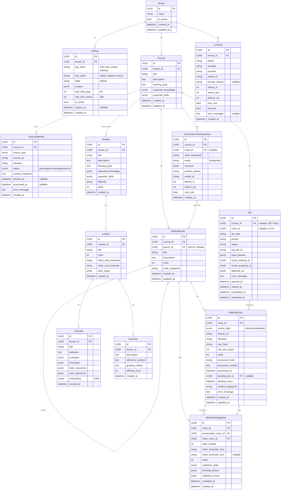

# ERD: Course як окрема сутність vs Root Node

## Діаграма 1 — Поточна структура (AS-IS)

### Проблеми поточної структури

1. **Дублювання метаданих** — Course і Module мають ідентичні поля
   (`learning_goal`, `expected_knowledge`, `expected_skills`),
   а MaterialNode — ту ж ієрархію, але без цих полів.

2. **Course = штучний кореневий рівень** — по суті це root node,
   винесений в окрему таблицю. Кожен Course має рівно одне дерево
   MaterialNode. Course не існує без дерева, дерево не існує без Course.

3. **Tenant isolation через JOIN** — Job не має `tenant_id`, ізоляція
   через `Job → Course → tenant_id` (додатковий JOIN).

4. **SourceMaterial — legacy-дублікат MaterialEntry** — прив'язаний до
   Course, а не до Node. Має іншу структуру, інший lifecycle.

5. **Рекурсивний аналіз неможливий** — MaterialNode не має полів для
   learning goals. Коли в майбутньому кожен вузол аналізуватиметься
   окремо (goal → knowledge → skills → exercises), ці поля потрібні
   на кожному рівні дерева, а не лише на рівні Course.

---

## Діаграма 2 — Запропонована структура (TO-BE)

**Ключові зміни:**
- Course видаляється — root MaterialNode (parent_id IS NULL) = курс
- Module/Lesson/Concept/Exercise → єдиний рекурсивний StructureNode
- LLMCall → ExternalServiceCall (універсальний журнал зовнішніх сервісів)
- StructureSnapshot спрощений — метадані виклику в ExternalServiceCall
- Консистентні назви FK: `{table_name}_id`

```mermaid
%%{init: {'theme': 'default', 'themeVariables': {'fontSize': '24px'}}}%%
erDiagram
    Tenant {
        UUID id PK
        string name
        bool is_active
        datetime created_at
        datetime updated_at
    }

    APIKey {
        UUID id PK
        UUID tenant_id FK
        string key_hash "SHA-256, unique, indexed"
        string key_prefix "first chars of key"
        string label "default"
        jsonb scopes
        int rate_limit_prep "60"
        int rate_limit_check "300"
        bool is_active
        datetime expires_at "nullable"
        datetime created_at
    }

    MaterialNode {
        UUID id PK
        UUID tenant_id FK "denormalized"
        UUID parent_materialnode_id FK "self-ref, NULL = root = course"
        string title
        text description
        text learning_goal "nullable"
        jsonb expected_knowledge "nullable"
        jsonb expected_skills "nullable"
        int order
        string node_fingerprint "Merkle hash"
        datetime created_at
        datetime updated_at
    }

    MaterialEntry {
        UUID id PK
        UUID materialnode_id FK
        enum source_type "video|pres|text|web"
        int order
        string source_url
        string filename "nullable"
        string raw_hash "nullable"
        int raw_size_bytes "nullable"
        string processed_hash "nullable"
        text processed_content "nullable"
        datetime processed_at "nullable"
        UUID job_id FK "nullable, pending job"
        datetime pending_since "nullable"
        text error_message "nullable"
        datetime created_at
        datetime updated_at
    }

    SlideVideoMapping {
        UUID id PK
        UUID materialnode_id FK
        UUID presentation_materialentry_id FK
        UUID video_materialentry_id FK
        int slide_number
        string video_timecode_start
        string video_timecode_end "nullable"
        int order
        enum validation_state
        jsonb blocking_factors "nullable"
        jsonb validation_errors "nullable"
        datetime validated_at "nullable"
        datetime created_at
    }

    StructureSnapshot {
        UUID id PK
        UUID materialnode_id FK "target subtree"
        UUID externalservicecall_id FK "call details"
        string node_fingerprint "Merkle hash for idempotency"
        jsonb structure "raw LLM response"
        datetime created_at
    }

    StructureNode {
        UUID id PK
        UUID structuresnapshot_id FK
        UUID parent_structurenode_id FK "self-ref, nullable"
        string node_type "module|lesson|concept|exercise|..."
        int order
        string title
        text description "nullable"
        text learning_goal "nullable"
        jsonb expected_knowledge "nullable, list of summary+details"
        jsonb expected_skills "nullable, list of summary+details"
        jsonb prerequisites "nullable, list of str"
        string difficulty "nullable, easy|medium|hard"
        int estimated_duration "nullable, minutes"
        text success_criteria "nullable"
        string assessment_method "nullable"
        jsonb competencies "nullable, list of str"
        jsonb key_concepts "nullable, list of summary+details"
        jsonb common_mistakes "nullable, list of str"
        string teaching_strategy "nullable"
        jsonb activities "nullable, list of str"
        string teaching_style "nullable"
        jsonb deep_dive_references "nullable"
        datetime content_version "nullable"
        jsonb timecodes "nullable, filled by indexer"
        jsonb slide_references "nullable, filled by indexer"
        jsonb web_references "nullable, filled by indexer"
        vector embedding "1536, filled by pipeline"
        datetime created_at
        datetime updated_at
    }

    Job {
        UUID id PK
        UUID tenant_id FK "NOT NULL"
        UUID materialnode_id FK "nullable, target node"
        string job_type
        string priority
        string status
        string arq_job_id "nullable"
        jsonb input_params "nullable"
        jsonb depends_on "nullable, list of Job UUIDs"
        text error_message "nullable"
        datetime queued_at
        datetime started_at "nullable"
        datetime completed_at "nullable"
        datetime estimated_at "nullable"
    }

    ExternalServiceCall {
        UUID id PK
        UUID tenant_id FK "nullable, system calls"
        UUID job_id FK "nullable, outside job queue"
        string action
        string strategy
        string provider
        string model_id
        string prompt_ref "nullable"
        string unit_type "nullable, tokens|minutes|chars"
        int unit_in "nullable"
        int unit_out "nullable"
        int latency_ms "nullable"
        float cost_usd "nullable"
        bool success "default true"
        text error_message "nullable"
        datetime created_at
    }

    Tenant ||--o{ APIKey : "has"
    Tenant ||--o{ MaterialNode : "has"
    Tenant ||--o{ Job : "has"
    Tenant ||--o{ ExternalServiceCall : "has"
    MaterialNode ||--o{ MaterialNode : "children"
    MaterialNode ||--o{ MaterialEntry : "has"
    MaterialNode ||--o{ SlideVideoMapping : "scope"
    MaterialNode ||--o{ StructureSnapshot : "generated for"
    MaterialEntry ||--o{ SlideVideoMapping : "presentation"
    MaterialEntry ||--o{ SlideVideoMapping : "video"
    Job ||--o{ MaterialEntry : "pending job"
    Job ||--o{ ExternalServiceCall : "calls"
    StructureSnapshot ||--o{ StructureNode : "contains"
    StructureNode ||--o{ StructureNode : "children"
    ExternalServiceCall ||--o| StructureSnapshot : "produces"
```

### Що змінилося (AS-IS → TO-BE)

| Аспект | AS-IS (14 таблиць) | TO-BE (9 таблиць) |
|--------|-------|-------|
| **Кореневий рівень** | Course (окрема таблиця) | MaterialNode з `parent_materialnode_id IS NULL` |
| **Tenant isolation** | Через Course (JOIN) | Пряма: `tenant_id` на MaterialNode, Job, ExternalServiceCall |
| **Learning metadata** | Тільки Course + Module | Кожен MaterialNode (рекурсивно) |
| **Output structure** | Module → Lesson → Concept → Exercise (4 таблиці, фіксована глибина) | StructureNode (1 рекурсивна таблиця, довільна глибина) |
| **LLM tracking** | LLMCall (тільки LLM) | ExternalServiceCall (всі зовнішні сервіси, universal billing units) |
| **Snapshot metadata** | Дублювання (tokens, cost, model в snapshot + LLMCall) | Єдине джерело: ExternalServiceCall, snapshot посилається через FK |
| **Job results** | result_material_id + result_snapshot_id (дублювання, CHECK constraint) | Немає — результат знаходиться через "замовника" |
| **Fingerprints** | content_fingerprint на MaterialEntry + node_fingerprint на MaterialNode | Тільки node_fingerprint на MaterialNode (processed_hash використовується в Merkle) |
| **FK naming** | Різні стилі (node_id, pending_job_id, course_id) | Консистентне: `{tablename}_id` |
| **SourceMaterial** | Legacy таблиця → Course | **Видалено** |
| **Course** | Окрема таблиця | **Видалено** |
| **Видалені таблиці** | — | Course, SourceMaterial, Module, Lesson, Concept, Exercise (−6) |
| **Нові таблиці** | — | StructureNode (+1) |
| **Перейменовані** | LLMCall | ExternalServiceCall |
| **Кількість таблиць** | 14 | 9 |
