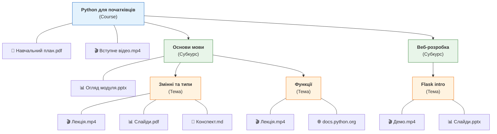
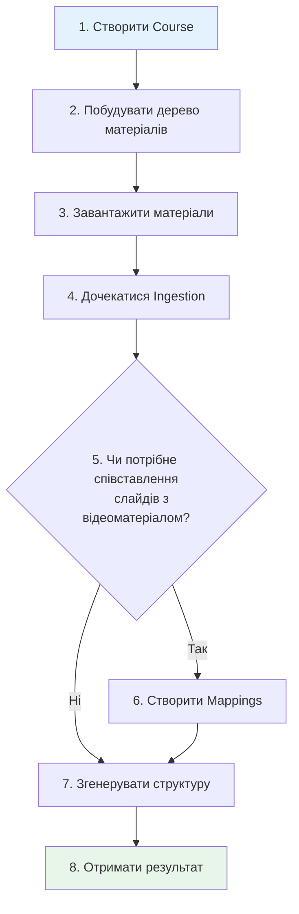

# Огляд роботи з API

Course Supporter перетворює навчальні матеріали — відео, презентації, документи та веб-сторінки — у структурований план курсу (модулі, уроки, концепти, вправи) за допомогою LLM-аналізу.

Цей документ описує повний робочий процес: які кроки потрібні, як вони пов'язані між собою, і чого очікувати на кожному етапі.

## Приклад структури курсу

Ось як може виглядати дерево матеріалів готового курсу:



**Ключові принципи:**

- **Course** — контейнер верхнього рівня
- **Nodes** (субкурси, теми, підтеми) — утворюють ієрархію довільної глибини
- **Матеріали** — прикріплюються до будь-якого рівня ієрархії
- На кожному рівні можуть бути як дочірні nodes, так і матеріали одночасно

## Основні поняття

Перш ніж переходити до flow, ось ключові сутності, з якими ви працюватимете:

| Поняття | Опис |
|---------|------|
| **Course** | Контейнер верхнього рівня. Все належить конкретному курсу. |
| **Material Tree** | Ієрархія **nodes** для організації матеріалів (як файлова система). |
| **Node** | Папка в дереві матеріалів. Може містити дочірні nodes та material entries. |
| **Material Entry** | Окремий матеріал (файл або URL), прикріплений до node. |
| **Ingestion** | Автоматична обробка матеріалу: транскрипція, розпізнавання слайдів, web scraping, парсинг тексту. |
| **Slide-Video Mapping** | Опціональна прив'язка слайдів презентації до таймкодів відео. |
| **Structure Generation** | LLM-аналіз, який створює структурований план курсу з оброблених матеріалів. |
| **Snapshot** | Збережений результат генерації. Може існувати кілька snapshot'ів (версіонування). |
| **Job** | Асинхронна задача (ingestion або generation). Відстежується через polling. |

## Основний flow



### Крок 1: Створити Course

Створіть контейнер верхнього рівня для ваших матеріалів та згенерованої структури.

**Endpoint:** `POST /api/v1/courses`

### Крок 2: Побудувати дерево матеріалів

Організуйте матеріали у дерево nodes. Це як створення папок перед завантаженням файлів.

- Створити кореневий node: `POST /api/v1/courses/{course_id}/nodes`
- Додати дочірній node: `POST /api/v1/courses/{course_id}/nodes/{node_id}/children`
- За потреби: перемістити, змінити порядок, перейменувати або видалити nodes

Простий курс може мати лише один кореневий node. Складний — багаторівневу ієрархію (за темами, тижнями, модулями тощо).

### Крок 3: Завантажити матеріали

Прикріпіть матеріали до nodes дерева.

**Endpoint:** `POST /api/v1/courses/{course_id}/nodes/{node_id}/materials`

Кожне завантаження автоматично запускає **ingestion** — система обробляє матеріал у фоні та повертає `job_id` для відстеження.

### Крок 4: Дочекатися Ingestion

Ingestion працює асинхронно. Опитуйте статус job'у до завершення.

**Endpoint:** `GET /api/v1/jobs/{job_id}`

Коли `status` зміниться на `complete` — матеріал готовий. Якщо `failed` — перевірте `error_message` та за потреби повторіть.

!!! warning "Час обробки може суттєво відрізнятися"
    Текстові документи та веб-сторінки обробляються за секунди. Але **відео та презентації** — це "важкі" операції: транскрипція відео може тривати десятки хвилин або навіть години залежно від тривалості.

    Крім того, при високому навантаженні система може **відкласти** обробку важких матеріалів. Час очікування в черзі залежить від завантаженості і може сягати доби. Інформація про орієнтовний час обробки повертається у відповіді на запит статусу job'у (поле `estimated_at`).

### Крок 6: (Опціонально) Створити Slide-Video Mappings

Якщо у вашому курсі є і презентації, і відео — можна прив'язати конкретні слайди до таймкодів відео. Це дає LLM багатший контекст для генерації структури.

**Endpoint:** `POST /api/v1/courses/{course_id}/nodes/{node_id}/slide-mapping`

Mappings валідуються автоматично (структурні, контентні та відкладені перевірки). Цей крок опціональний — генерація працює і без mappings.

### Крок 7: Згенерувати структуру

Коли матеріали оброблені (state: `ready`), запустіть генерацію структури.

**Endpoint:** `POST /api/v1/courses/{course_id}/generate`

Доступні два режими:

- **Free mode** (за замовчуванням): генерує структуру з нуля на основі всіх матеріалів
- **Guided mode**: використовує раніше згенеровану структуру як основу — зберігає існуючу ієрархію, збагачує та уточнює її. Працює як з новими матеріалами, так і без них (наприклад, для повторної генерації з покращеним промптом або іншою LLM-моделлю)

Якщо деякі матеріали застаріли (контент змінився після останнього ingestion), система автоматично ставить в чергу повторний ingestion перед генерацією.

Генерація — також асинхронна операція. Відстежуйте `job_id` через polling (як у кроці 4).

### Крок 8: Отримати результат

Отримайте згенеровану структуру курсу.

**Endpoint:** `GET /api/v1/courses/{course_id}/structure`

Результат — вкладений JSON з модулями, уроками, концептами та вправами, готовий для використання у вашій навчальній платформі.

## Підтримувані типи матеріалів

| Тип | Формати файлів | Як обробляється |
|-----|---------------|-----------------|
| **Video** | .mp4, .webm, .mkv, .avi | Транскрипція (Gemini API, Whisper як fallback) |
| **Presentation** | .pdf, .pptx | Витягування слайдів + візуальний опис через LLM |
| **Text** | .md, .docx, .html, .txt | Витягування та парсинг контенту |
| **Web** | URL (без завантаження файлу) | Web scraping через trafilatura |

## Асинхронні операції

Дві операції працюють асинхронно і потребують polling:

1. **Ingestion матеріалів** — запускається автоматично при завантаженні матеріалу
2. **Генерація структури** — запускається явно через endpoint генерації

Обидві повертають `job_id`. Використовуйте `GET /api/v1/jobs/{job_id}` для відстеження.

**Життєвий цикл Job:**

```
queued → active → complete
                → failed
```

**Рекомендований polling-патерн:**

- Перший запит — через 2-3 секунди після створення job'у
- Для текстових матеріалів і web: опитуйте кожні 5 секунд
- Для відео та презентацій: опитуйте кожні 30-60 секунд (обробка може тривати хвилини або години)
- Орієнтуйтесь на поле `estimated_at` у відповіді — воно містить прогнозований час завершення
- При `failed` — перевірте `error_message`, за потреби повторіть

## Автентифікація

Всі API-запити потребують API key у заголовку `X-API-Key`.

**Scopes:**

| Scope | Доступ |
|-------|--------|
| `prep` | Повний доступ: створення, оновлення, видалення, генерація |
| `check` | Тільки читання: перегляд курсів, матеріалів, структур |

Rate limits діють для кожного tenant та scope. Якщо ви досягли ліміту, відповідь містить заголовок `Retry-After`.

## Що далі?

- **[Швидкий старт](quick-start.md)** — покрокова інструкція з curl-прикладами
- **[API Reference](reference.md)** — детальна документація для кожного endpoint
- **[Автентифікація](auth.md)** — API keys, scopes та rate limits
