# Entity Relationship Diagram

!!! note "Updated per sprint"
    This ERD reflects the current database schema and is updated with each sprint.
    Source: [`current-doc/Sprint-2-ERD.mermaid`](https://github.com/kostyantynzivenko/course-supporter/blob/main/current-doc/Sprint-2-ERD.mermaid)

```mermaid
erDiagram
    %% ═══════════════════════════════════════
    %% Multi-Tenant Auth
    %% ═══════════════════════════════════════

    Tenant {
        uuid id PK "UUIDv7"
        string name UK "unique"
        bool is_active
        timestamptz created_at
        timestamptz updated_at
    }

    APIKey {
        uuid id PK "UUIDv7"
        uuid tenant_id FK
        string key_hash UK "sha256, indexed"
        string key_prefix
        string label
        jsonb scopes "['prep','check']"
        int rate_limit_prep "default 60"
        int rate_limit_check "default 300"
        bool is_active
        timestamptz expires_at "nullable"
        timestamptz created_at
    }

    Tenant ||--o{ APIKey : "has keys"

    %% ═══════════════════════════════════════
    %% Course (tenant-scoped root)
    %% ═══════════════════════════════════════

    Course {
        uuid id PK "UUIDv7"
        uuid tenant_id FK "indexed"
        string title
        text description "nullable"
        text learning_goal "nullable"
        jsonb expected_knowledge "nullable"
        jsonb expected_skills "nullable"
        timestamptz created_at
        timestamptz updated_at
    }

    Tenant ||--o{ Course : "owns"

    %% ═══════════════════════════════════════
    %% Material Tree (recursive adjacency list)
    %% ═══════════════════════════════════════

    MaterialNode {
        uuid id PK "UUIDv7"
        uuid course_id FK "indexed"
        uuid parent_id FK "self-ref, nullable, indexed"
        string title
        text description "nullable"
        int order "default 0"
        string node_fingerprint "lazy cached Merkle hash, nullable"
        timestamptz created_at
        timestamptz updated_at
    }

    Course ||--o{ MaterialNode : "has tree"
    MaterialNode ||--o{ MaterialNode : "children (parent_id)"

    %% ═══════════════════════════════════════
    %% Material Entry (raw + processed + state)
    %% ═══════════════════════════════════════

    MaterialEntry {
        uuid id PK "UUIDv7"
        uuid node_id FK "indexed"
        enum source_type "video|presentation|text|web"
        int order "default 0"
        string source_url "S3 or external URL"
        string filename "nullable"
        string raw_hash "lazy cached sha256, nullable"
        int raw_size_bytes "nullable"
        string processed_hash "raw_hash at processing time, nullable"
        text processed_content "SourceDocument JSON, nullable"
        timestamptz processed_at "nullable"
        uuid pending_job_id FK "nullable, receipt"
        timestamptz pending_since "nullable"
        string content_fingerprint "lazy cached sha256, nullable"
        text error_message "nullable"
        timestamptz created_at
        timestamptz updated_at
    }

    MaterialNode ||--o{ MaterialEntry : "has materials"

    %% ═══════════════════════════════════════
    %% Slide-Video Mapping
    %% ═══════════════════════════════════════

    SlideVideoMapping {
        uuid id PK "UUIDv7"
        uuid node_id FK "indexed"
        uuid presentation_entry_id FK "MaterialEntry (presentation)"
        uuid video_entry_id FK "MaterialEntry (video)"
        int slide_number "slide in this presentation"
        string video_timecode_start "HH:MM:SS"
        string video_timecode_end "nullable, HH:MM:SS"
        int order "appearance order in video"
        string validation_state "validated|pending_validation|validation_failed"
        jsonb blocking_factors "nullable, what blocks validation"
        jsonb validation_errors "nullable, failed checks"
        timestamptz validated_at "nullable"
        timestamptz created_at
    }

    MaterialNode ||--o{ SlideVideoMapping : "has mappings"
    MaterialEntry ||--o{ SlideVideoMapping : "as presentation"
    MaterialEntry ||--o{ SlideVideoMapping : "as video"

    %% ═══════════════════════════════════════
    %% Job Tracking (ARQ + persistence)
    %% ═══════════════════════════════════════

    Job {
        uuid id PK "UUIDv7"
        uuid course_id FK "nullable, indexed"
        uuid node_id FK "nullable, indexed"
        string job_type "ingestion|structure_generation"
        string priority "normal|immediate"
        string status "queued|active|complete|failed"
        string arq_job_id "ARQ internal ID"
        jsonb input_params
        uuid result_material_id FK "nullable, CHECK: at most one result FK"
        uuid result_snapshot_id FK "nullable, CHECK: at most one result FK"
        jsonb depends_on "nullable, list of job_ids"
        text error_message "nullable"
        timestamptz queued_at
        timestamptz started_at "nullable"
        timestamptz completed_at "nullable"
        timestamptz estimated_at "nullable"
    }

    Course ||--o{ Job : "has jobs"
    MaterialNode ||--o{ Job : "scoped to node"
    MaterialEntry }o--o| Job : "pending_job_id"
    Job }o--o| MaterialEntry : "result_material_id"
    Job }o--o| CourseStructureSnapshot : "result_snapshot_id"

    %% ═══════════════════════════════════════
    %% Course Structure Snapshots
    %% ═══════════════════════════════════════

    CourseStructureSnapshot {
        uuid id PK "UUIDv7"
        uuid course_id FK "indexed"
        uuid node_id FK "nullable (NULL=whole course), indexed"
        string node_fingerprint "Merkle hash at generation time"
        string mode "free|guided"
        jsonb structure "CourseStructure JSON"
        string prompt_version "nullable"
        string model_id "nullable"
        int tokens_in "nullable"
        int tokens_out "nullable"
        float cost_usd "nullable"
        timestamptz created_at
    }

    Course ||--o{ CourseStructureSnapshot : "has snapshots"
    MaterialNode ||--o{ CourseStructureSnapshot : "scoped to node"

    %% ═══════════════════════════════════════
    %% Course Structure (generated output)
    %% Snapshot stores raw LLM output as JSONB;
    %% when "applied", unpacked into normalized tables below.
    %% ═══════════════════════════════════════

    Module {
        uuid id PK "UUIDv7"
        uuid course_id FK
        uuid snapshot_id FK "nullable, source snapshot"
        string title
        text description "nullable"
        text learning_goal "nullable"
        jsonb expected_knowledge "nullable"
        jsonb expected_skills "nullable"
        string difficulty "easy|medium|hard"
        int order
        timestamptz created_at
    }

    Course ||--o{ Module : "has modules"
    CourseStructureSnapshot ||--o{ Module : "applied from"

    Lesson {
        uuid id PK "UUIDv7"
        uuid module_id FK
        string title
        int order
        string video_start_timecode "nullable"
        string video_end_timecode "nullable"
        jsonb slide_range "nullable"
        timestamptz created_at
    }

    Module ||--o{ Lesson : "has lessons"

    Concept {
        uuid id PK "UUIDv7"
        uuid lesson_id FK
        string title
        text definition
        jsonb examples "nullable"
        jsonb timecodes "nullable"
        jsonb slide_references "nullable"
        jsonb web_references "nullable"
        vector embedding "1536 dims, nullable"
        timestamptz created_at
    }

    Lesson ||--o{ Concept : "has concepts"

    Exercise {
        uuid id PK "UUIDv7"
        uuid lesson_id FK
        text description
        text reference_solution "nullable"
        text grading_criteria "nullable"
        int difficulty_level "nullable, 1-5"
        timestamptz created_at
    }

    Lesson ||--o{ Exercise : "has exercises"

    %% ═══════════════════════════════════════
    %% Observability
    %% ═══════════════════════════════════════

    LLMCall {
        uuid id PK "UUIDv7"
        uuid tenant_id FK "nullable, indexed"
        string action
        string strategy
        string provider
        string model_id
        string prompt_version "nullable"
        int tokens_in "nullable"
        int tokens_out "nullable"
        int latency_ms "nullable"
        float cost_usd "nullable"
        bool success
        text error_message "nullable"
        timestamptz created_at
    }

    Tenant ||--o{ LLMCall : "tracked calls"
```

