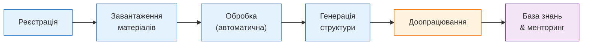

# What is Course Supporter

**Course Supporter** — AI-система, яка перетворює навчальні матеріали курсу на структуровану базу знань і надає інструменти для автоматизації рутинних задач викладача.

## Що це дає освітній платформі

Уявіть: у вас є курс — відеолекції, презентації, конспекти, посилання на документацію. Все це розкидано по папках і хмарних сховищах. Course Supporter:

1. **Приймає ваші матеріали як є** — відео, PDF, PPTX, Markdown, DOCX, HTML, посилання на веб-ресурси
2. **Аналізує і структурує** — транскрибує відео, розпізнає слайди, витягує текст, скрапить веб-сторінки
3. **Генерує структуру курсу** — модулі, уроки, концепти, вправи — з усього масиву матеріалів через LLM-аналіз
4. **Дає можливість доопрацювати** — скоригувати акценти, змінити структуру, перегенерувати з іншими параметрами

А далі — на базі побудованої структури і проаналізованих матеріалів:

- Побудова **бази знань курсу** (embedding + vector search)
- Автоматична **перевірка і рев'ю** домашніх завдань студентів
- **Генерація індивідуальних завдань** з урахуванням рівня студента
- **Персоналізоване рев'ю** з урахуванням історії помилок конкретного студента

!!! note "Поточний стан"
    Зараз реалізовано повний pipeline підготовки матеріалів: завантаження, обробка, генерація структури курсу. Функціональність перевірки завдань, embedding та персоналізації — в активній розробці.

## Загальний flow роботи



| Етап | Статус | Опис |
|------|--------|------|
| Реєстрація | Працює | Отримання tenant та API keys |
| Завантаження матеріалів | Працює | Організація в дерево + upload файлів і URL |
| Обробка | Працює | Транскрипція, розпізнавання слайдів, scraping |
| Генерація структури | Працює | LLM-аналіз, structured output, версіонування |
| Доопрацювання | В розробці | Коригування акцентів, розробка завдань |
| База знань & менторинг | В розробці | Embedding, рев'ю завдань, персоналізація |

## Як організувати матеріали

Перед завантаженням зручно уявити матеріали курсу як **файлову систему** — дерево тек:

```
Python для початківців/               # кореневий рівень (курс)
    навчальний-план.pdf               # матеріали, що описують курс вцілому
    вступне-відео.mp4
    Основи мови/                      # розділ
        огляд-модуля.pptx             # матеріали розділу
        Змінні та типи/               # підрозділ
            лекція.mp4
            слайди.pdf
            конспект.md
        Функції/                      # підрозділ
            лекція.mp4
            docs.python.org/...       # посилання на веб-ресурс
    Веб-розробка/                     # розділ
        Flask intro/                  # підрозділ
            демо.mp4
            слайди.pptx
```

**Принципи:**

- **Кореневий рівень** — увесь курс. Тут розміщуються матеріали, що стосуються курсу вцілому (навчальний план, вступне відео тощо), та вкладені теки розділів.
- **Кожна тека** — структурна одиниця курсу (розділ, тема, підтема). Містить матеріали цього рівня та вкладені теки для дрібніших частин.
- **Глибина вкладення — довільна.** Структура може бути настільки детальною, наскільки потрібно для опису вашого курсу.
- На кожному рівні можуть бути одночасно і матеріали, і дочірні елементи.

В API ця структура відображається як **Material Tree** — дерево **nodes** (тек) з прикріпленими **material entries** (файлами/посиланнями).

## Підтримувані типи матеріалів

### Відео

| Спосіб | Деталі |
|--------|--------|
| Завантаження файлу | `.mp4`, `.webm`, `.mkv`, `.avi` |
| Посилання на відеохостинг | YouTube (гарантовано), Vimeo (підтримується, потребує додаткового тестування) |

Відео обробляється через транскрипцію: спочатку Gemini API (vision), при невдачі — Whisper (локально). Для посилань аудіо завантажується через yt-dlp, який підтримує сотні платформ, але гарантована робота — тільки з YouTube.

!!! warning "Нeперевірені платформи"
    Якщо ви надаєте посилання на платформу, яка не входить до перевіреного списку, API поверне warning. Обробка відбудеться в режимі best effort.

### Презентації

| Формат | Обробка |
|--------|---------|
| `.pdf` | Рендеринг сторінок + візуальний опис через LLM |
| `.pptx` | Рендеринг слайдів + візуальний опис через LLM |

### Текстові документи

| Формат | Обробка |
|--------|---------|
| `.md`, `.markdown` | Парсинг Markdown |
| `.docx` | Витягування тексту |
| `.html`, `.htm` | Парсинг HTML |
| `.txt` | Читання як plain text |

### Веб-ресурси

Передаються як URL (без завантаження файлу). Система витягує контент через web scraping.

Перевірені домени: `wikipedia.org`, `github.com`, `docs.python.org`, `developer.mozilla.org`, `realpython.com`. Інші домени обробляються в режимі best effort з попередженням.

## Що далі

- **[Реєстрація та автентифікація](auth.md)** — як отримати доступ до API
- **[Підготовка та завантаження матеріалів](materials.md)** — покрокова інструкція з прикладами
