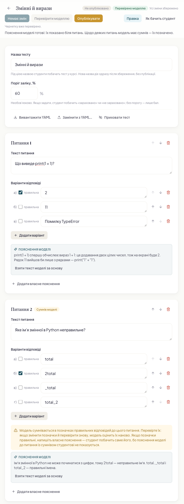
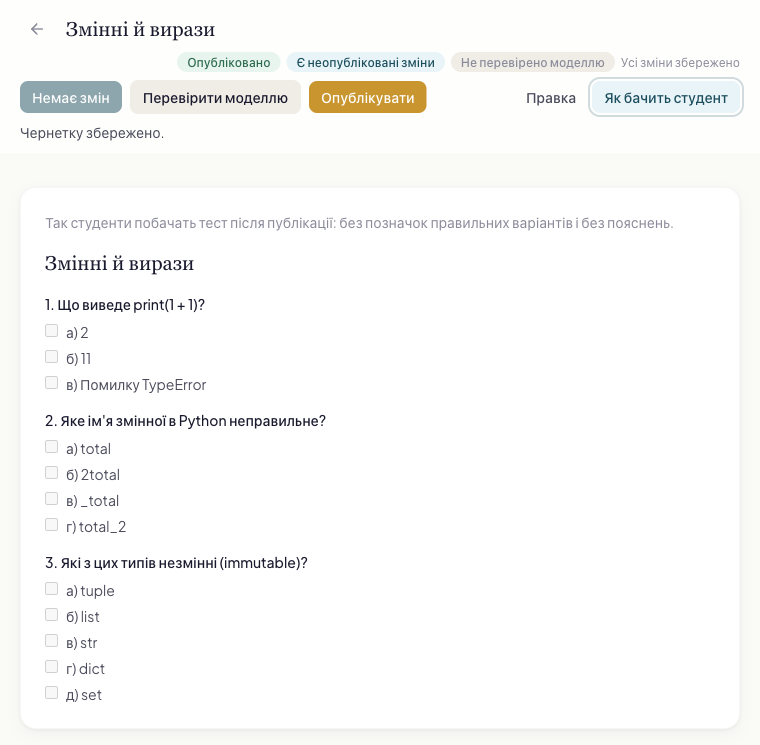
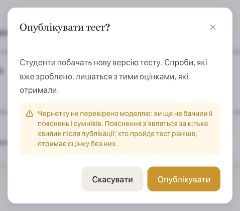

# Для авторів

## Тест, який перевіряє система {#test}

Тест перевіряється за правильними відповідями, які ви позначили в самому тесті: система звіряє з
ними відповіді студента. Студент позначає варіанти просто в порталі (або на платформі вашої школи)
і отримує рецензію без очікування на викладача: бал, вердикт і пояснення до кожної неправильної
відповіді.

Пояснення система пише сама — з питань і ваших позначок. До будь-якого питання ви можете написати
власне пояснення, і студент побачить саме його.

Тест живе в системі у двох видах: **чернетка**, яку ви правите, і **опубліковані версії**, які
бачать студенти. Поки ви не опублікували тест уперше, студенти його не бачать зовсім. Чернетку можна
перевірити до публікації: система напише пояснення до питань і скаже, у яких позначках сумнівається,
а студенти нічого з цього не побачать (див. [Перевірити чернетку](#check)).

Тест пишуть, перевіряють і публікують у [редакторі тесту](#editor) програми автора.

## Редактор тесту {#editor}

У редакторі тесту ви пишете, перевіряєте й публікуєте тест просто в програмі автора — без YAML і без
запитів. Файл YAML лишається, щоб завантажити тест готовим чи вивантажити його, а запити до API, описані
нижче на цій сторінці, — довідка для платформ, які працюють із тестами без програми автора.



*Редактор тесту. Угорі — назва, стан тесту й дії; нижче — назва й поріг заліку, потім картки питань.
Чернетку перевірено моделлю: біля кожного питання — пояснення моделі, а в позначках другого питання
модель сумнівається.*

### Відкрити тест чи почати новий {#editor-open}

- **Наявний тест.** У дереві курсу оберіть розділ і в рядку тесту натисніть «Відкрити тест». У дереві
  тест зветься своєю назвою.
- **Новий тест.** Натисніть «Новий тест» у меню розділу (правою кнопкою миші на картці розділу) чи
  однойменну кнопку в панелі розділу. Редактор відкриється порожнім: впишіть назву тесту й натисніть
  «Зберегти чернетку». Тест з'явиться в розділі: «Тест створено. Студенти не побачать його, доки ви його
  не опублікуєте.»
- Стрілка ліворуч від назви («До курсу») повертає до курсу.

### Назва, поріг і питання {#editor-questions}

Угорі — «Назва тесту» й «Поріг заліку, %». Під назвою тест бачать студенти; нова назва діє одразу після
збереження, без публікації. Поріг — необов'язковий: із ним студент побачить «зараховано» чи «не
зараховано», без нього — лише бал (див. [Як рахується бал](#score)).

Нижче — картка на кожне питання: «Текст питання» і «Варіанти відповіді», біля кожного варіанта —
прапорець «правильна». Позначте всі правильні варіанти: їх може бути кілька, і тоді напишіть у тексті
питання, скільки відповідей обрати. «Додати питання» й «Додати варіант» додають нове, стрілки вгору й
униз переміщують питання чи варіант, кошик прибирає. Номери питань і літери варіантів редактор ставить
сам і після переміщення оновлює.

«Додати власне пояснення» відкриває під питанням поле «Власне пояснення». Написати його можна одразу, до
перевірки: студент побачить його замість пояснення моделі — навіть коли модель сумнівається.
«Прибрати власне пояснення» прибирає поле.

Межі ті самі, що й у файлі: до 200 питань і до 26 варіантів у питанні; текст питання й пояснення — до
2 000 знаків, текст варіанта — до 500.

### Зберегти чернетку {#editor-save}

«Зберегти чернетку» зберігає тест таким, яким він є, — і незавершеним. Автозбереження немає: поки ви
не збережете, біля назви стоїть «Є незбережені зміни», а спроба піти зі сторінки спитає «Піти без
збереження?». Після збереження — «Усі зміни збережено».

- **Жовті підказки** показують, що лишилось завершити: «Впишіть текст питання.», «Впишіть текст
  варіанта.», «Додайте варіанти: потрібно щонайменше два.», «Позначте хоча б один правильний
  варіант.». Це не помилки: чернетка з ними зберігається. Перевірити й опублікувати тест можна, коли
  жовтих підказок не лишиться (див. [Незавершена чернетка](#incomplete)).
- **Червоні помилки** — те, чого зберегти не можна: порожня чи задовга назва, поріг, що не є цілим
  числом від 1 до 100, задовгий текст. Помилка стоїть біля свого поля, чернетка не зберігається, а
  вгорі — «Чернетку не збережено: виправте позначене червоним нижче.». Якщо текст не прийняла сама
  система, її відмова стоїть біля того питання й варіанта, які вона назвала.

### Перевірити моделлю {#editor-check}

«Перевірити моделлю» замовляє для збереженої чернетки пояснення до кожного питання й сумніви моделі щодо
ваших позначок. Студенти нічого з цього не бачать: перевірка нічого не публікує. Коли кнопка
недоступна, поруч сказано чому: «Спершу збережіть тест.», «Спершу збережіть зміни.», «Щоб перевірити чи
опублікувати тест, завершіть позначені місця.» чи «Чернетку вже перевірено.».

Скільки це коштує: перевірка нової чи зміненої чернетки — одне написання пояснень моделлю, стільки ж,
скільки коштувала б публікація без перевірки. Перевірка незміненої чернетки, уже перевіреної чи
опублікованої, нічого не коштує. Зміна порогу чи власних пояснень перевірки не скидає.

Після натискання — «Перевірку замовлено: пояснення й сумніви моделі з'являться біля питань за
хвилину-дві.» і позначка «Перевірка йде…». Коли пояснення готові, позначка стає «Перевірено моделлю»:

- біля кожного питання — блок «Пояснення моделі»;
- питання, у позначках якого модель сумнівається, отримує позначку «Сумнів моделі» й підказку, що
  робити: перевірте позначки; якщо вони правильні, напишіть власне пояснення (див. [Сумнів](#doubt));
- «Взяти текст моделі за основу» копіює пояснення моделі у ваше власне пояснення, щоб ви його
  поправили; пояснення моделі лишається таким, як було.

Якщо після перевірки змінити питання, варіанти чи позначки, редактор попередить: «Ви змінили питання,
варіанти чи позначки — після збереження тест треба буде перевірити знову.» Якщо перевірка не вдалася —
«Перевірка не вдалася»: натисніть «Перевірити моделлю» ще раз.

### Як бачить студент {#editor-student}

Перемикач «Правка» · «Як бачить студент» показує тест так, як його побачать студенти після публікації:
питання з літерами варіантів, без позначок правильних і без пояснень.

Позначки біля назви кажуть, де тест: «Новий тест» — ще не збережений, «Не опубліковано» — студенти його
не бачать, «Опубліковано» — бачать. «Є неопубліковані зміни» — чернетка відрізняється від версії, яку
бачать студенти: вони й далі бачать попередню версію, поки ви не опублікуєте нову.



*«Як бачить студент». Біля назви — «Опубліковано» й «Є неопубліковані зміни»: студенти бачать
попередню версію, доки ви не опублікуєте цю.*

### Опублікувати {#editor-publish}

«Опублікувати» спершу питає «Опублікувати тест?» і каже, що зміниться: перша публікація — «Тест
побачать студенти курсу.», нова версія — «Студенти побачать нову версію тесту. Спроби, які вже зроблено,
лишаться з тими оцінками, які отримали.»

- **Перевірену чернетку** публікують без доплати: «Пояснення моделі вже готові.»
- **Неперевірену чернетку** теж можна опублікувати — вікно попереджає, що ви ще не бачили пояснень і
  сумнівів моделі: пояснення з'являться за кілька хвилин після публікації, і хто пройде тест раніше,
  отримає оцінку без них. Публікація сама замовить пояснення.

Після публікації — «Опубліковано: студенти бачать цю версію тесту.» Студенти одразу бачать і складають
нову версію; що саме створює нову версію, див. [Що створює нову версію](#versions).



*Публікація неперевіреної чернетки: вікно попереджає, що пояснення моделі з'являться вже після
публікації.*

### YAML і приховування {#editor-yaml}

- «Вивантажити YAML» зберігає чернетку разом із назвою у файл YAML. Файл несе правильні відповіді — не
  давайте його студентам.
- «Замінити з YAML…» замінює чернетку вмістом файла після підтвердження «Замінити чернетку файлом?».
  Опублікована версія не зміниться, доки ви не опублікуєте тест знову. Формат файла — див.
  [Як записати тест](#yaml).
- «Приховати тест» після підтвердження «Приховати тест?» прибирає тест із курсу для студентів; спроби,
  які вже зроблено, збережуться. Скасувати приховування в програмі автора не можна.

## Як записати тест {#yaml}

Тест записується у форматі YAML — простому тексті, де кожне поле стоїть на своєму рядку, а
вкладеність показують відступи з пробілів. Приклад:

```yaml
title: Робота з агентом — тест до уроку 3
pass_threshold: 80
questions:
  - text: Що таке контекстне вікно моделі?
    options:
      - text: Вікно редактора, у якому агент показує зміни
        correct: false
      - text: Обсяг тексту, який модель бачить за один виклик
        correct: true
      - text: Час, протягом якого сесія агента лишається активною
        correct: false
  - text: Що варто зробити після кожної зміни, яку зробив агент? Оберіть дві відповіді.
    options:
      - text: Запустити тести
        correct: true
      - text: Видалити історію змін
        correct: false
      - text: Переглянути, що саме змінилося
        correct: true
    explanation: Тести показують, чи не зламала зміна те, що вже працювало.
```

| поле | обов'язкове | що це |
|---|---|---|
| `title` | ні | назва тесту, яку бачать студенти, до 200 знаків; без неї тест, завантажений файлом, дістає ім'я файла без розширення |
| `pass_threshold` | ні | поріг заліку — ціле число відсотків від 1 до 100: яку частку питань треба відповісти правильно, щоб тест було зараховано (див. [Як рахується бал](#score)); без порогу рецензія покаже бал, але не скаже «зараховано» чи «не зараховано» |
| `questions` | так | питання, до 200; щоб перевірити й опублікувати тест — хоча б одне |
| `text` питання | так | текст питання, до 2 000 знаків |
| `options` | так | варіанти відповіді, до 26; щоб перевірити й опублікувати тест — хоча б 2 в кожному питанні |
| `text` варіанта | так | текст варіанта, до 500 знаків |
| `correct` | так | `true` — варіант правильний, `false` — неправильний; щоб перевірити й опублікувати тест, у кожному питанні хоча б один `true` |
| `explanation` | ні | ваше власне пояснення до питання, до 2 000 знаків; порожнє — те саме, що його немає |

- **Номерів і літер не пишіть.** Система нумерує питання й ставить літери варіантів сама, за
  порядком: для курсу українською — `а`, `б`, `в`…, для решти — `a`, `b`, `c`….
- **Будь-яке інше поле — помилка**, як і порожня назва. Пробіли на початку й у кінці тексту система
  прибирає.
- **Незавершену чернетку можна зберегти**: без питань (`questions: []`), з питанням без варіантів чи з
  одним, без жодного `correct: true`, з порожнім текстом питання чи варіанта. Поля `questions`,
  `text`, `options` і `correct` пишуться завжди — порожнім може бути лише значення, а `correct` — лише
  `true` чи `false`. Перевірити й опублікувати можна лише завершений тест (див.
  [Незавершена чернетка](#incomplete)).
- **Текст лишається текстом**: `8`, `yes` чи `null` у полі `text` система читає саме як текст. Але
  якщо текст містить двокрапку чи знак `#` або починається не з літери чи цифри, візьміть його в
  подвійні лапки, а лапки всередині такого тексту пишіть як `\"`: інакше YAML прочитає його
  по-своєму — наприклад, усе після ` #` сприйме як примітку й відкине.
- **Текст на кілька рядків** почніть знаком `|`, а рядки запишіть нижче з додатковим відступом.
- Файл чи запит — не більше 256 КБ.

### Кілька правильних відповідей

Питання може мати кілька правильних варіантів — позначте кожен `correct: true`. Форма ставить
прапорці біля всіх варіантів у кожному питанні, тож скільки варіантів позначати, студент дізнається
лише з тексту питання. Напишіть це словами: «Оберіть дві відповіді», «Позначте всі правильні».

Питання зараховується, лише коли позначено **рівно** всі правильні варіанти — не більше й не менше.
Питання без жодної позначки рахується неправильним.

## Як рахується бал {#score}

- **Кожне питання важить однаково**, хоч би скільки в ньому варіантів.
- **Питання зараховане лише за точного збігу**: студент позначив рівно ті варіанти, які ви позначили
  правильними, — не більше й не менше. Зайвий позначений варіант, як і пропущений правильний, робить
  питання незарахованим. Питання без відповіді дає нуль.
- **Бал** — частка зарахованих питань у відсотках, округлена вниз до цілого: 6 питань із 7 — це 85, а
  не 86.
- **Залік** — бал, не менший за поріг (`pass_threshold`). Без порогу вердикту немає: рецензія покаже
  лише бал.

Приклад — тест із 7 питань, поріг 80:

| зараховано питань | бал | вердикт |
|---|---|---|
| 7 із 7 | 100 | зараховано |
| 6 із 7 | 85 | зараховано |
| 5 із 7 | 71 | не зараховано |

Поріг зручно ставити, рахуючи, скільки питань студент може пропустити. При 7 питаннях пороги 80 і 85
дають однаковий результат: тест зараховано з 6 правильними відповідями й не зараховано з 5.

## Як створити тест {#create}

**Файлом.** У програмі автора завантажте YAML-файл (`.yaml` чи `.yml`) у потрібний розділ курсу, як
будь-який матеріал, і оберіть вид завдання «Тест». Система не обробляє такий файл, як лекцію: вона
одразу перевіряє його й створює тест із чернеткою; сам файл не зберігається. Якщо у файлі помилка
формату, тест не створюється, а відмова називає її місце (див. [Коли тест відмовлено](#refusals)).
Незавершений тест створюється — його можна дописати пізніше (див. [Незавершена чернетка](#incomplete)).

У програмі автора тест починають кнопкою «Новий тест» і правлять у [редакторі тесту](#editor). Запити
до API нижче — довідка для платформ, які працюють із тестами без програми автора: ключ доступу вашої
школи з правом підготовки курсу (сфера `PREP`) — у заголовку `X-API-Key`, `$NODE_ID` — розділ курсу,
`$TEST_ID` — тест.

Те саме завантаження запитом — вид джерела (`source_type`) обов'язковий, але для тесту не важить:

```bash
curl -X POST https://api.pythoncourse.me/api/v1/nodes/$NODE_ID/documents \
     -H "X-API-Key: $PREP_KEY" \
     -F source_type=text -F task_type=test -F file=@lecture-3-test.yaml
```

**Запитом.** Тіло — YAML (`Content-Type: application/yaml`) або та сама структура в JSON
(`application/json`); назва (`title`) тут обов'язкова:

```bash
curl -X POST https://api.pythoncourse.me/api/v1/nodes/$NODE_ID/tests \
     -H "X-API-Key: $PREP_KEY" -H "Content-Type: application/yaml" \
     --data-binary @lecture-3-test.yaml
```

Відповідь **201** — тест: `id` (це й є `$TEST_ID`), `title`, `draft` — питання з номерами, варіанти з
літерами й позначками — і `published: null`, а поруч — поля, описані в
[Що показує читання чернетки](#draft). Завантаження файлом теж повертає `id` тесту.

## Чернетка й публікація {#publish}

Прочитати чернетку — з літерами варіантів і позначками — і чинну версію:

```bash
curl https://api.pythoncourse.me/api/v1/tests/$TEST_ID/draft -H "X-API-Key: $PREP_KEY"
```

`published` — чинна версія: `number` (номер за порядком), `version` (позначка того, що бачить
студент) і `published_at`; до першої публікації — `null`. Решту полів — що лишилось завершити, що
знайшла перевірка, чи є неопубліковані зміни — описано в [Що показує читання чернетки](#draft).

Замінити чернетку — цілком, YAML чи JSON, як при створенні:

```bash
curl -X PUT https://api.pythoncourse.me/api/v1/tests/$TEST_ID/draft \
     -H "X-API-Key: $PREP_KEY" -H "Content-Type: application/yaml" \
     --data-binary @lecture-3-test.yaml
```

Чернетка з помилкою формату не зберігається — лишається попередня; незавершена зберігається така, як
є (див. [Незавершена чернетка](#incomplete)). `title` у новій чернетці перейменовує тест одразу, без
публікації; без `title` назва лишається та сама. Решту правок студенти не бачать, поки ви не
опублікуєте чернетку. Перед публікацією її можна перевірити (див. [Перевірити чернетку](#check)).

```bash
curl -X POST https://api.pythoncourse.me/api/v1/tests/$TEST_ID/publish -H "X-API-Key: $PREP_KEY"
```

Відповідь **201** — опубліковано нову версію; **200** — чернетка така сама, як чинна версія, і нічого
не змінилося. Нова версія одразу стає тією, яку бачать і складають студенти. Пояснення мовою курсу до
нових питань, варіантів чи позначок система пише під час перевірки чернетки, а якщо чернетку не
перевіряли, — після публікації; публікація перевіреної чернетки бере їх готовими й нічого не доплачує
(див. [Пояснення](#explanations)).

**422** [`TEST_DRAFT_INCOMPLETE`](#TEST_DRAFT_INCOMPLETE) — чернетку не завершено; нічого не
опубліковано.

**409** [`GENERATION_IN_PROGRESS`](#GENERATION_IN_PROGRESS) — система саме пише пояснення до цього
тесту; з публікації нічого не збережено. Зачекайте, доки вона закінчить, і опублікуйте ще раз.

### Незавершена чернетка {#incomplete}

Тест можна писати частинами: чернетка зберігається й без питань, з питанням без варіантів чи з одним,
без позначки `correct: true`, з порожнім текстом питання чи варіанта. Перевірити й опублікувати можна
лише завершену чернетку — незавершеній обидві дії відмовляють кодом
[`TEST_DRAFT_INCOMPLETE`](#TEST_DRAFT_INCOMPLETE), і нічого не змінюється.

Що лишилось завершити, читання чернетки показує в полі `incomplete` — у тому порядку, у якому ви
читаєте тест: текст питання, тексти варіантів, скільки варіантів, чи позначено правильний. Кожне
місце — код, номер питання (`question`) і номер варіанта (`option`), рахуючи з 1; чого місце не
стосується, те `null`. Порожній перелік — чернетку завершено.

```json
"incomplete": [
  {"code": "TEST_TEXT_EMPTY", "question": 1, "option": 2},
  {"code": "TEST_NO_CORRECT_OPTION", "question": 3, "option": null}
]
```

| код | місце | що не так | що зробити |
|---|---|---|---|
| `TEST_NO_QUESTIONS` {#TEST_NO_QUESTIONS} | тест | питань немає | додайте питання |
| `TEST_TEXT_EMPTY` {#TEST_TEXT_EMPTY} | питання, а коли задано `option`, — варіант | порожній текст | напишіть текст |
| [`TEST_OPTIONS_COUNT`](#TEST_OPTIONS_COUNT) | питання | менше двох варіантів | додайте варіанти |
| `TEST_NO_CORRECT_OPTION` {#TEST_NO_CORRECT_OPTION} | питання з варіантами | жоден варіант не позначено `correct: true` | позначте правильні варіанти |

### Перевірити чернетку {#check}

Перевірка показує ще до публікації, що система напише до тесту: пояснення до кожного питання мовою
курсу й сумніви у ваших позначках (див. [Сумнів](#doubt)). Перевірка нічого не публікує: студенти
нічого з неї не бачать.

```bash
curl -X POST https://api.pythoncourse.me/api/v1/tests/$TEST_ID/check -H "X-API-Key: $PREP_KEY"
```

Відповідь **200** — стан перевірки: `state`, `explanations` і `doubts`, як у полі `check` читання
чернетки (див. [Що показує читання чернетки](#draft)). `in_progress` — система пише пояснення; коли
допише, читання чернетки покаже `ready`. `ready` — пояснення до цих самих питань, варіантів і позначок
уже написано, і вони вже у відповіді.

Скільки це коштує:

- **Чернетка, до якої пояснень ще немає** — нова чи змінена в питаннях, варіантах чи позначках, — одне
  написання пояснень: стільки ж коштувала б її публікація без перевірки.
- **Незмінена чернетка, уже перевірена чи опублікована**, — нічого: система віддає те, що вже написала.
  Повторний запит, поки перевірка йде, теж нічого не коштує.
- **Публікація перевіреної чернетки** нічого не доплачує, навіть поки перевірка ще йде: нова версія
  бере пояснення, які написала чи пише перевірка.
- **Поріг заліку й ваші власні пояснення** перевірки не скидають: змінивши лише їх, перевіряти знову не
  треба, і публікація теж нічого не доплатить.

Якщо перевірка не вдалася (`failed` у читанні чернетки), перевірте ще раз — система спробує заново.
Публікувати без перевірки теж можна: тоді пояснення система напише після публікації.

**422** [`TEST_DRAFT_INCOMPLETE`](#TEST_DRAFT_INCOMPLETE) — чернетку не завершено; нічого не
перевірено. **409** [`GENERATION_IN_PROGRESS`](#GENERATION_IN_PROGRESS) — система саме пише інші
пояснення до цього тесту; нічого не збережено — перевірте ще раз, коли вона закінчить.

### Що показує читання чернетки {#draft}

Читання чернетки — як і відповідь створення й заміни — несе, крім самої чернетки (`draft`) і чинної
версії (`published`):

- **`incomplete`** — що лишилось завершити (див. [Незавершена чернетка](#incomplete)); порожній
  перелік — чернетку завершено.
- **`check`** — що знайшла перевірка чернетки такої, як вона є: `state` — стан перевірки (таблиця
  нижче), `explanations` — пояснення системи за номерами питань, `doubts` — питання, у позначках яких
  система сумнівається, наприклад `{"2": true}` (див. [Сумнів](#doubt)). Доки стан не `ready`,
  `explanations` і `doubts` порожні. Ваші власні пояснення — у самій чернетці, окремо від пояснень
  системи.
- **`unpublished_changes`** — чи дасть публікація нову версію: `true`, коли чернетка відрізняється від
  чинної версії питаннями, варіантами, позначками, порогом, вашими поясненнями чи мовою курсу, і до
  першої публікації. Нова назва змін не додає: її видно одразу.
- **`course_root_id`** — курс, у якому стоїть тест.

| `check.state` | що означає |
|---|---|
| `not_checked` | чернетку не перевіряли, змінили в питаннях, варіантах чи позначках після перевірки або ще не завершили |
| `in_progress` | система пише пояснення |
| `ready` | пояснення й сумніви написано |
| `failed` | пояснення написати не вдалося — перевірте ще раз |

Наприклад, так виглядають ці поля перевіреної, але ще не опублікованої чернетки:

```json
{
  "incomplete": [],
  "check": {"state": "ready", "explanations": {"1": "…", "2": "…"}, "doubts": {"2": true}},
  "unpublished_changes": true,
  "course_root_id": "…"
}
```

Читання нічого не замовляє й нічого не коштує.

### Що створює нову версію {#versions}

- **Змінено питання, варіанти чи позначки правильності** — нова версія з новими поясненнями системи.
  Якщо ви перевірили цю чернетку, пояснення вже написано, і публікація бере їх готовими; якщо ні —
  система пише їх після публікації.
- **Змінено лише поріг заліку чи лише ваші власні пояснення** — нова версія, але студент бачить ті самі
  питання й варіанти, а пояснення системи заново не пишуться.
- **Чернетку повернуто до давнішого стану** — наприклад, скасовано правку, — нова версія, і саме вона
  стає чинною. Пояснення, які система вже написала для того стану, служать знову.
- **Та сама чернетка, опублікована вдруге**, нічого не змінює.

Рецензії на спроби, зроблені до публікації, лишаються такими, як були. Нову спробу перевіряють за
версією, чинною тієї миті, коли студент надіслав відповіді.

Студент, який відкрив тест до публікації, а відповідає після неї: якщо змінилися питання чи варіанти,
відповіді на стару версію не приймаються — студент перечитує тест і відповідає знову; якщо змінилися
лише позначки, поріг чи ваші пояснення, відповіді приймаються й перевіряються за новою версією.

## Пояснення {#explanations}

Пояснення до кожного питання система пише мовою курсу — один раз для тих самих питань, варіантів і
позначок: коли ви перевіряєте чернетку (див. [Перевірити чернетку](#check)), а якщо не перевіряли, —
після публікації, що змінила питання, варіанти чи позначки. Стан пояснень чинної версії:

```bash
curl https://api.pythoncourse.me/api/v1/documents/$TEST_ID/reference -H "X-API-Key: $PREP_KEY"
```

Відповідь несе `status`: `awaiting_key` — тест ще не опубліковано, `generating` — пояснення
пишуться, `ready` — усе готово, `failed` — пояснення написати не вдалося (причину названо в
`failure_reason`; щоб спробувати знову, опублікуйте тест ще раз). Поруч — `answers` (літери
правильних варіантів чинної версії), `pass_threshold`, `explanations` (ваші власні й ті, що написала
система) і `doubts` (див. [Сумнів](#doubt)). Що знайшла перевірка ще не опублікованої чернетки, цей
запит не показує — це показує читання чернетки (`check`, див. [Що показує читання чернетки](#draft)).

### Власні пояснення

Студент, який відповів на питання неправильно, бачить правильний варіант і пояснення. Якщо ви
написали власне пояснення до цього питання (`explanation`), студент бачить **саме його**, а не
пояснення системи — навіть коли система має сумнів щодо цього питання.

Власні пояснення показуються так, як ви їх написали, і вважаються написаними мовою курсу: якщо
студент читає рецензію іншою мовою, рецензія скаже, що пояснення подано мовою курсу.

### Сумнів {#doubt}

Пишучи пояснення, система може засумніватися у вашій позначці — наприклад, коли позначений варіант,
на її думку, неправильний. Таке питання отримує позначку сумніву й стоїть у `doubts`, наприклад
`{"2": true}`: у читанні чернетки, яку ви перевірили (`check`), і в читанні стану чинної версії.

Сумнів **не змінює балу**: відповіді студентів і далі перевіряються за вашими позначками. Але
студент, який відповів на таке питання неправильно, не побачить пояснення системи — лише
«Неправильно», правильний варіант і примітку, що пояснення до цього питання немає. Ваше власне
пояснення він побачить.

Що робити: перевірте позначки цього питання. Якщо позначка хибна — виправте її в чернетці й
опублікуйте. Якщо правильна — допишіть до питання власне пояснення й опублікуйте: пояснення системи
заново не пишуться. Сумніви зручно побачити ще до публікації, перевіривши чернетку (див.
[Перевірити чернетку](#check)): так ви встигнете виправити позначку чи дописати пояснення, перш ніж
тест побачать студенти.

## Вивантажити тест у YAML {#export}

```bash
curl https://api.pythoncourse.me/api/v1/tests/$TEST_ID/yaml -H "X-API-Key: $PREP_KEY" -o lecture-3-test.yaml
```

Відповідь — чернетка разом із назвою у форматі YAML, з полями в тому самому порядку, що й у прикладі
вище. Цей файл можна виправити й завантажити назад заміною чернетки. Вивантаження несе правильні
відповіді, тож його віддають лише ключем вашої школи з правом підготовки курсу; студент і платформа
школи його не отримують.

## Приховати тест {#hide}

Приховайте тест кнопкою «Приховати тест» — у редакторі тесту чи в рядку тесту в дереві курсу — або
запитом `DELETE /api/v1/documents/$TEST_ID`. Тест зникає з курсу для студентів. Уже зроблені спроби й
рецензії на них система зберігає, але через курс студент до них більше не дістанеться.

Роль тесту змінити не можна: тест — завжди навчальний матеріал. Методичного матеріалу студенти не
бачать, тож тест тихо зник би з курсу; такий запит відмовляє кодом
[`TEST_OBJECT_ROLE_FIXED`](#TEST_OBJECT_ROLE_FIXED).

## Коли тест відмовлено {#refusals}

Відмова несе в полі `detail` код причини й пояснення, а відмова формату — ще й місце:
`{"code": "…", "details": "…", "place": {…}}`. `place` називає рядок і стовпчик у YAML (`line`,
`column`) і номер питання й варіанта (`question`, `option`), рахуючи з 1; чого немає — `null`.
Відмова незавершеної чернетки замість місця несе перелік `incomplete` (див.
[`TEST_DRAFT_INCOMPLETE`](#TEST_DRAFT_INCOMPLETE)). Нічого з відмовленого запиту не зберігається: ні
тесту, ні зміни чернетки, ні нової версії.

### `TEST_YAML_UNREADABLE` {#TEST_YAML_UNREADABLE}

**422.** YAML (чи JSON) не читається — синтаксична помилка, наприклад неоднакові відступи чи
двокрапка в тексті без лапок. `place` називає рядок і стовпчик. Виправте запис у цьому місці.

### `TEST_YAML_DUPLICATE_KEY` {#TEST_YAML_DUPLICATE_KEY}

**422.** Те саме поле двічі в одному місці — наприклад, два `text` в одному варіанті. `place`
називає друге. Лишіть одне.

### `TEST_YAML_ALIAS` {#TEST_YAML_ALIAS}

**422.** У файлі є якір чи посилання YAML — `&` чи `*` перед назвою. Запишіть текст повністю в
кожному місці, де він потрібен.

### `TEST_FIELD_INVALID` {#TEST_FIELD_INVALID}

**422.** Поле невідоме чи відсутнє, назва порожня, поле не того виду (наприклад, `correct: так`
замість `true` або поріг `80.5`) чи задовге. `details` каже, що саме не так, `place` — де. Виправте
поле за [таблицею формату](#yaml). Створення тесту запитом без `title` теж дає цю відмову.

### `TEST_OPTIONS_COUNT` {#TEST_OPTIONS_COUNT}

**422.** У питанні понад 26 варіантів. `place` називає питання. Розділіть питання на кілька.

Той самий код у переліку `incomplete` означає інше: у питанні менше двох варіантів. Така чернетка
зберігається, але перевірити й опублікувати її можна, лише додавши варіанти (див.
[Незавершена чернетка](#incomplete)).

### `TEST_TOO_LARGE` {#TEST_TOO_LARGE}

**413.** Файл чи тіло запиту більші за 256 КБ. Розділіть тест на кілька.

### `SECURITY_REJECTED` {#SECURITY_REJECTED}

**400.** Текст тесту містить невидимі символи (так буває з текстом, скопійованим із Word чи
вебсторінки) або фрази, схожі на вказівки системі, що пише пояснення, чи файл не вдалося прочитати як
текст. Поле `category` називає, що саме знайдено: `suspicious_unicode`, `prompt_injection` чи
`charset_violation`. Наберіть підозрілий текст заново — або збережіть файл у кодуванні UTF-8 — і
надішліть тест ще раз.

### `NOT_A_TEST_OBJECT` {#NOT_A_TEST_OBJECT}

**422.** Ідентифікатор веде до іншого матеріалу вашої школи, а не до тесту, створеного в системі:
наприклад, до лекції чи до тесту, колись завантаженого текстом. Перевірте ідентифікатор. Тест,
завантажений текстом, відповідей більше не приймає — створіть його заново з YAML.

**404** `Document not found` — тесту немає, його видалено або він належить іншій школі; **404**
`Node not found` — те саме для розділу, у якому ви створюєте тест. **415** — тіло запиту не YAML і
не JSON.

### `TEST_DRAFT_INCOMPLETE` {#TEST_DRAFT_INCOMPLETE}

**422.** Перевірка чи публікація незавершеної чернетки. Замість `place` відмова несе перелік
`incomplete` — той самий, що й читання чернетки: кожне місце, яке лишилось завершити, з кодом і
номерами питання й варіанта (див. [Незавершена чернетка](#incomplete)):

```json
{"detail": {"code": "TEST_DRAFT_INCOMPLETE", "details": "…",
            "incomplete": [{"code": "TEST_NO_CORRECT_OPTION", "question": 2, "option": null}]}}
```

Нічого не перевірено й не опубліковано. Завершіть кожне місце з переліку, збережіть чернетку й
повторіть перевірку чи публікацію.

### `GENERATION_IN_PROGRESS` {#GENERATION_IN_PROGRESS}

**409.** Система саме пише пояснення до цього тесту — до іншого стану чернетки, до чинної версії чи
мовою когось зі студентів. З перевірки чи публікації нічого не збережено. Зачекайте, доки вона
закінчить, і повторіть запит.

## Відмови завантаження й зміни матеріалу {#material-refusals}

Ці коди дають маршрути матеріалів — завантаження, зміна, повторна обробка, — коли справа стосується
тесту. Тіло — `{"code": "…", "details": "…"}`; нічого не збережено.

### `TEST_FILE_NOT_YAML` {#TEST_FILE_NOT_YAML}

**422.** Матеріал із видом завдання «Тест» — не YAML-файл (`.yaml`, `.yml`), а інший файл чи
посилання. Тест із тексту чи документа Word система більше не приймає. Запишіть тест у YAML і
завантажте файлом.

### `TEST_OBJECT_SOURCE_RESERVED` {#TEST_OBJECT_SOURCE_RESERVED}

**422.** Запит сам вказав вид джерела `test_object` — цей вид ставить лише система. Завантажте
YAML-файл із видом завдання «Тест» або створіть тест запитом (див. [Як створити тест](#create)).

### `TEST_OBJECT_TYPE_FIXED` {#TEST_OBJECT_TYPE_FIXED}

**422.** Спроба змінити вид завдання тесту, створеного в системі. Тест лишається тестом; якщо
потрібне інше завдання — створіть новий матеріал.

### `TEST_OBJECT_ROLE_FIXED` {#TEST_OBJECT_ROLE_FIXED}

**422.** Спроба зробити тест, створений у системі, методичним матеріалом — поставити йому роль
(`material_role`), відмінну від `educational`. Тест завжди навчальний: методичного матеріалу студенти
не бачать. Роль лишається навчальною; щоб прибрати тест від студентів, приховайте його (див.
[Приховати тест](#hide)).

### `TEST_IS_AN_OBJECT` {#TEST_IS_AN_OBJECT}

**422.** Спроба зробити тестом наявний матеріал, змінивши його вид завдання. Тест створюється з YAML —
завантажте файл або створіть тест запитом.

### `TEST_OBJECT_NOT_PROCESSED` {#TEST_OBJECT_NOT_PROCESSED}

**422.** Повторна обробка чи ролі файлів для тесту, створеного в системі: такий тест не обробляється,
як лекція. Щоб змінити тест, змініть чернетку й опублікуйте.

### `KEY_LIVES_IN_TEST` {#KEY_LIVES_IN_TEST}

**422.** Запит замінити чи прибрати ключ відповідей (`PUT` чи `DELETE …/reference/override`) для
тесту, створеного в системі. Правильні відповіді — позначки `correct` у самому тесті: змініть
чернетку й опублікуйте.
